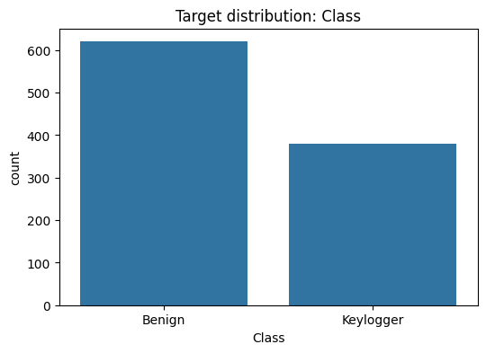

# Keylogger detection


<!-- WARNING: THIS FILE WAS AUTOGENERATED! DO NOT EDIT! -->

PLANNING: - INTRO - short dataset description. - EDA - shape, dtypes,
missing, class balance, sample rows, correlations. - PREPARING DATA -
drop useless columns, fix dtype issues, parse timestamps, coerce
numerics, encode label. - DATA SPLITTING - splitting training and
testing data. - RESULTS - early results. - PREPARING MODELS - prepare
hyperparameter, baseline models., baseline models. - RESULTS WITH
MULTIPLES MODELS- metrics (precision/recall/f1), confusion matrix. -
BALANCING - try balancing and compare. - RESULTS (after balancing) -
compare metrics. - CONCLUSION - state best model, tradeoffs, next steps.

# EDA

## Importamos las librerías necesarias y cargamos el dataset

``` python
import pandas as pd
from pathlib import Path

base_dir = Path.cwd()
csv_file_path = base_dir.parent.parent / "data" / "keylogger_detection" / "Keylogger_Detection_sample.csv"
data = pd.read_csv(csv_file_path, low_memory=False, index_col=0)
# Para hacer más rápido el procesamiento, tomamos una muestra del dataset
df = data.sample(n=1000, random_state=42)
df.head(1)
```

<div>
<style scoped>
    .dataframe tbody tr th:only-of-type {
        vertical-align: middle;
    }
&#10;    .dataframe tbody tr th {
        vertical-align: top;
    }
&#10;    .dataframe thead th {
        text-align: right;
    }
</style>

<table class="dataframe" data-quarto-postprocess="true" data-border="1">
<thead>
<tr style="text-align: right;">
<th data-quarto-table-cell-role="th"></th>
<th data-quarto-table-cell-role="th">Source IP</th>
<th data-quarto-table-cell-role="th">Source Port</th>
<th data-quarto-table-cell-role="th">Destination IP</th>
<th data-quarto-table-cell-role="th">Destination Port</th>
<th data-quarto-table-cell-role="th">Protocol</th>
<th data-quarto-table-cell-role="th">Timestamp</th>
<th data-quarto-table-cell-role="th">Flow Duration</th>
<th data-quarto-table-cell-role="th">Total Fwd Packets</th>
<th data-quarto-table-cell-role="th">Total Backward Packets</th>
<th data-quarto-table-cell-role="th">Total Length of Fwd Packets</th>
<th data-quarto-table-cell-role="th">...</th>
<th data-quarto-table-cell-role="th">min_seg_size_forward</th>
<th data-quarto-table-cell-role="th">Active Mean</th>
<th data-quarto-table-cell-role="th">Active Std</th>
<th data-quarto-table-cell-role="th">Active Max</th>
<th data-quarto-table-cell-role="th">Active Min</th>
<th data-quarto-table-cell-role="th">Idle Mean</th>
<th data-quarto-table-cell-role="th">Idle Std</th>
<th data-quarto-table-cell-role="th">Idle Max</th>
<th data-quarto-table-cell-role="th">Idle Min</th>
<th data-quarto-table-cell-role="th">Class</th>
</tr>
<tr>
<th data-quarto-table-cell-role="th">Flow ID</th>
<th data-quarto-table-cell-role="th"></th>
<th data-quarto-table-cell-role="th"></th>
<th data-quarto-table-cell-role="th"></th>
<th data-quarto-table-cell-role="th"></th>
<th data-quarto-table-cell-role="th"></th>
<th data-quarto-table-cell-role="th"></th>
<th data-quarto-table-cell-role="th"></th>
<th data-quarto-table-cell-role="th"></th>
<th data-quarto-table-cell-role="th"></th>
<th data-quarto-table-cell-role="th"></th>
<th data-quarto-table-cell-role="th"></th>
<th data-quarto-table-cell-role="th"></th>
<th data-quarto-table-cell-role="th"></th>
<th data-quarto-table-cell-role="th"></th>
<th data-quarto-table-cell-role="th"></th>
<th data-quarto-table-cell-role="th"></th>
<th data-quarto-table-cell-role="th"></th>
<th data-quarto-table-cell-role="th"></th>
<th data-quarto-table-cell-role="th"></th>
<th data-quarto-table-cell-role="th"></th>
<th data-quarto-table-cell-role="th"></th>
</tr>
</thead>
<tbody>
<tr>
<td
data-quarto-table-cell-role="th">172.217.11.34-10.42.0.211-443-32906-6</td>
<td>10.42.0.211</td>
<td>32906.0</td>
<td>172.217.11.34</td>
<td>443.0</td>
<td>6.0</td>
<td>12/07/2017 02:05:31</td>
<td>4508467.0</td>
<td>2.0</td>
<td>0.0</td>
<td>0.0</td>
<td>...</td>
<td>32.0</td>
<td>0.0</td>
<td>0.0</td>
<td>0.0</td>
<td>0.0</td>
<td>0.0</td>
<td>0.0</td>
<td>0.0</td>
<td>0.0</td>
<td>Keylogger</td>
</tr>
</tbody>
</table>

<p>1 rows × 84 columns</p>
</div>

## Realizamos un analisis exploratorio sobre los datos

### Exploramos la forma general del dataset

``` python
# Realizamos un analysis exploratorio sobre los datos
n = 5
print("Shape:", df.shape)
print("\nColumns and dtypes:")
print(df.dtypes)
print("\nNumeric summary (describe):")
display(df.describe().T)
```

    Shape: (1000, 84)

    Columns and dtypes:
     Source IP            object
     Source Port         float64
     Destination IP       object
     Destination Port    float64
     Protocol            float64
                          ...   
    Idle Mean            float64
     Idle Std            float64
     Idle Max            float64
     Idle Min            float64
    Class                 object
    Length: 84, dtype: object

    Numeric summary (describe):

<div>
<style scoped>
    .dataframe tbody tr th:only-of-type {
        vertical-align: middle;
    }
&#10;    .dataframe tbody tr th {
        vertical-align: top;
    }
&#10;    .dataframe thead th {
        text-align: right;
    }
</style>

<table class="dataframe" data-quarto-postprocess="true" data-border="1">
<thead>
<tr style="text-align: right;">
<th data-quarto-table-cell-role="th"></th>
<th data-quarto-table-cell-role="th">count</th>
<th data-quarto-table-cell-role="th">mean</th>
<th data-quarto-table-cell-role="th">std</th>
<th data-quarto-table-cell-role="th">min</th>
<th data-quarto-table-cell-role="th">25%</th>
<th data-quarto-table-cell-role="th">50%</th>
<th data-quarto-table-cell-role="th">75%</th>
<th data-quarto-table-cell-role="th">max</th>
</tr>
</thead>
<tbody>
<tr>
<td data-quarto-table-cell-role="th">Source Port</td>
<td>1000.0</td>
<td>3.815298e+04</td>
<td>1.877217e+04</td>
<td>0.0</td>
<td>34250.75</td>
<td>42899.5</td>
<td>51987.25</td>
<td>6.490400e+04</td>
</tr>
<tr>
<td data-quarto-table-cell-role="th">Destination Port</td>
<td>1000.0</td>
<td>6.729693e+03</td>
<td>1.652872e+04</td>
<td>0.0</td>
<td>80.00</td>
<td>443.0</td>
<td>443.00</td>
<td>6.096000e+04</td>
</tr>
<tr>
<td data-quarto-table-cell-role="th">Protocol</td>
<td>1000.0</td>
<td>7.806000e+00</td>
<td>4.163616e+00</td>
<td>0.0</td>
<td>6.00</td>
<td>6.0</td>
<td>6.00</td>
<td>1.700000e+01</td>
</tr>
<tr>
<td data-quarto-table-cell-role="th">Flow Duration</td>
<td>1000.0</td>
<td>1.129487e+07</td>
<td>2.334697e+07</td>
<td>2.0</td>
<td>39036.00</td>
<td>471797.5</td>
<td>10096081.50</td>
<td>1.199892e+08</td>
</tr>
<tr>
<td data-quarto-table-cell-role="th">Total Fwd Packets</td>
<td>1000.0</td>
<td>7.618000e+00</td>
<td>2.790492e+01</td>
<td>1.0</td>
<td>1.00</td>
<td>2.0</td>
<td>6.00</td>
<td>7.050000e+02</td>
</tr>
<tr>
<td data-quarto-table-cell-role="th">...</td>
<td>...</td>
<td>...</td>
<td>...</td>
<td>...</td>
<td>...</td>
<td>...</td>
<td>...</td>
<td>...</td>
</tr>
<tr>
<td data-quarto-table-cell-role="th">Active Min</td>
<td>1000.0</td>
<td>1.704751e+05</td>
<td>1.716989e+06</td>
<td>0.0</td>
<td>0.00</td>
<td>0.0</td>
<td>0.00</td>
<td>4.993167e+07</td>
</tr>
<tr>
<td data-quarto-table-cell-role="th">Idle Mean</td>
<td>1000.0</td>
<td>4.599871e+06</td>
<td>1.548024e+07</td>
<td>0.0</td>
<td>0.00</td>
<td>0.0</td>
<td>0.00</td>
<td>1.145099e+08</td>
</tr>
<tr>
<td data-quarto-table-cell-role="th">Idle Std</td>
<td>1000.0</td>
<td>4.484078e+05</td>
<td>3.680408e+06</td>
<td>0.0</td>
<td>0.00</td>
<td>0.0</td>
<td>0.00</td>
<td>4.708189e+07</td>
</tr>
<tr>
<td data-quarto-table-cell-role="th">Idle Max</td>
<td>1000.0</td>
<td>4.972753e+06</td>
<td>1.636404e+07</td>
<td>0.0</td>
<td>0.00</td>
<td>0.0</td>
<td>0.00</td>
<td>1.145099e+08</td>
</tr>
<tr>
<td data-quarto-table-cell-role="th">Idle Min</td>
<td>1000.0</td>
<td>4.254974e+06</td>
<td>1.512216e+07</td>
<td>0.0</td>
<td>0.00</td>
<td>0.0</td>
<td>0.00</td>
<td>1.145099e+08</td>
</tr>
</tbody>
</table>

<p>80 rows × 8 columns</p>
</div>

### Verificamos valores nulos

``` python
# Resumen de valores nulos

missing_counts = df.isna().sum()
missing_percent = 100 * missing_counts / len(df)
missing_summary = pd.concat([missing_counts, missing_percent], axis=1)
missing_summary.columns = ["nulos", "porcentaje"]
print("\nNulos por columna (n y %):")
display(missing_summary.sort_values("nulos", ascending=False).head(20))
```


    Nulos por columna (n y %):

<div>
<style scoped>
    .dataframe tbody tr th:only-of-type {
        vertical-align: middle;
    }
&#10;    .dataframe tbody tr th {
        vertical-align: top;
    }
&#10;    .dataframe thead th {
        text-align: right;
    }
</style>

<table class="dataframe" data-quarto-postprocess="true" data-border="1">
<thead>
<tr style="text-align: right;">
<th data-quarto-table-cell-role="th"></th>
<th data-quarto-table-cell-role="th">nulos</th>
<th data-quarto-table-cell-role="th">porcentaje</th>
</tr>
</thead>
<tbody>
<tr>
<td data-quarto-table-cell-role="th">Source IP</td>
<td>0</td>
<td>0.0</td>
</tr>
<tr>
<td data-quarto-table-cell-role="th">URG Flag Count</td>
<td>0</td>
<td>0.0</td>
</tr>
<tr>
<td data-quarto-table-cell-role="th">Fwd Avg Bytes/Bulk</td>
<td>0</td>
<td>0.0</td>
</tr>
<tr>
<td data-quarto-table-cell-role="th">Fwd Header Length.1</td>
<td>0</td>
<td>0.0</td>
</tr>
<tr>
<td data-quarto-table-cell-role="th">Avg Bwd Segment Size</td>
<td>0</td>
<td>0.0</td>
</tr>
<tr>
<td data-quarto-table-cell-role="th">Avg Fwd Segment Size</td>
<td>0</td>
<td>0.0</td>
</tr>
<tr>
<td data-quarto-table-cell-role="th">Average Packet Size</td>
<td>0</td>
<td>0.0</td>
</tr>
<tr>
<td data-quarto-table-cell-role="th">Down/Up Ratio</td>
<td>0</td>
<td>0.0</td>
</tr>
<tr>
<td data-quarto-table-cell-role="th">ECE Flag Count</td>
<td>0</td>
<td>0.0</td>
</tr>
<tr>
<td data-quarto-table-cell-role="th">CWE Flag Count</td>
<td>0</td>
<td>0.0</td>
</tr>
<tr>
<td data-quarto-table-cell-role="th">ACK Flag Count</td>
<td>0</td>
<td>0.0</td>
</tr>
<tr>
<td data-quarto-table-cell-role="th">Source Port</td>
<td>0</td>
<td>0.0</td>
</tr>
<tr>
<td data-quarto-table-cell-role="th">PSH Flag Count</td>
<td>0</td>
<td>0.0</td>
</tr>
<tr>
<td data-quarto-table-cell-role="th">RST Flag Count</td>
<td>0</td>
<td>0.0</td>
</tr>
<tr>
<td data-quarto-table-cell-role="th">SYN Flag Count</td>
<td>0</td>
<td>0.0</td>
</tr>
<tr>
<td data-quarto-table-cell-role="th">FIN Flag Count</td>
<td>0</td>
<td>0.0</td>
</tr>
<tr>
<td data-quarto-table-cell-role="th">Packet Length Variance</td>
<td>0</td>
<td>0.0</td>
</tr>
<tr>
<td data-quarto-table-cell-role="th">Packet Length Std</td>
<td>0</td>
<td>0.0</td>
</tr>
<tr>
<td data-quarto-table-cell-role="th">Packet Length Mean</td>
<td>0</td>
<td>0.0</td>
</tr>
<tr>
<td data-quarto-table-cell-role="th">Max Packet Length</td>
<td>0</td>
<td>0.0</td>
</tr>
</tbody>
</table>

</div>

Revisamos su distribution

``` python
import matplotlib.pyplot as plt
import seaborn as sns

target_col = "Class"
figsize = (6, 4)

# Muestra los conteos y porcentajes para la variable binaria objetivo

vc = df[target_col].value_counts(dropna=False)
pct = (vc / len(df) * 100).round(2)
print("Counts:")
print(vc)
print("\nPercent:")
print(pct)

plt.figure(figsize=figsize)
sns.barplot(x=vc.index.astype(str), y=vc.values)
plt.title(f"Target distribution: {target_col}")
plt.ylabel("count")
plt.xlabel(target_col)
plt.show()
```

    Counts:
    Class
    Benign       620
    Keylogger    380
    Name: count, dtype: int64

    Percent:
    Class
    Benign       62.0
    Keylogger    38.0
    Name: count, dtype: float64



# PREPARING DATA

``` python
# Hacemos una copia del DataFrame original para no modificar el raw
df_clean = df.copy()

# Eliminamos filas con valores nulos
df_clean = df_clean.dropna()

# Verificamos que no queden valores nulos
df_clean.nunique().sort_values()

# Quitamos espacios en los nombres de las columnas
df_clean.columns = df_clean.columns.str.strip()

# Analizamos el tipo de columnas en busca de columnas que no sean numéricas o apropiadas para el análisis
df_clean.keys()
```

    Index(['Source IP', 'Source Port', 'Destination IP', 'Destination Port',
           'Protocol', 'Timestamp', 'Flow Duration', 'Total Fwd Packets',
           'Total Backward Packets', 'Total Length of Fwd Packets',
           'Total Length of Bwd Packets', 'Fwd Packet Length Max',
           'Fwd Packet Length Min', 'Fwd Packet Length Mean',
           'Fwd Packet Length Std', 'Bwd Packet Length Max',
           'Bwd Packet Length Min', 'Bwd Packet Length Mean',
           'Bwd Packet Length Std', 'Flow Bytes/s', 'Flow Packets/s',
           'Flow IAT Mean', 'Flow IAT Std', 'Flow IAT Max', 'Flow IAT Min',
           'Fwd IAT Total', 'Fwd IAT Mean', 'Fwd IAT Std', 'Fwd IAT Max',
           'Fwd IAT Min', 'Bwd IAT Total', 'Bwd IAT Mean', 'Bwd IAT Std',
           'Bwd IAT Max', 'Bwd IAT Min', 'Fwd PSH Flags', 'Bwd PSH Flags',
           'Fwd URG Flags', 'Bwd URG Flags', 'Fwd Header Length',
           'Bwd Header Length', 'Fwd Packets/s', 'Bwd Packets/s',
           'Min Packet Length', 'Max Packet Length', 'Packet Length Mean',
           'Packet Length Std', 'Packet Length Variance', 'FIN Flag Count',
           'SYN Flag Count', 'RST Flag Count', 'PSH Flag Count', 'ACK Flag Count',
           'URG Flag Count', 'CWE Flag Count', 'ECE Flag Count', 'Down/Up Ratio',
           'Average Packet Size', 'Avg Fwd Segment Size', 'Avg Bwd Segment Size',
           'Fwd Header Length.1', 'Fwd Avg Bytes/Bulk', 'Fwd Avg Packets/Bulk',
           'Fwd Avg Bulk Rate', 'Bwd Avg Bytes/Bulk', 'Bwd Avg Packets/Bulk',
           'Bwd Avg Bulk Rate', 'Subflow Fwd Packets', 'Subflow Fwd Bytes',
           'Subflow Bwd Packets', 'Subflow Bwd Bytes', 'Init_Win_bytes_forward',
           'Init_Win_bytes_backward', 'act_data_pkt_fwd', 'min_seg_size_forward',
           'Active Mean', 'Active Std', 'Active Max', 'Active Min', 'Idle Mean',
           'Idle Std', 'Idle Max', 'Idle Min', 'Class'],
          dtype='object')

``` python
# Eliminamos columnas irrelevantes
cols_to_drop = ["Source IP", "Destination IP", "Timestamp", "Fwd Header Length.1"]
df_clean = df_clean.drop(columns=cols_to_drop)
```

``` python
# Revisar columnas constantes
constant_cols = [c for c in df_clean.columns if df_clean[c].nunique() <= 1]
df_clean = df_clean.drop(columns=constant_cols)
```

``` python
# Revisar tipos y columnas mixtas
df_clean.dtypes.value_counts()
```

    float64    67
    object      1
    Name: count, dtype: int64

Nuestro objetivo es eliminar los datos innecesarios y la información no
numérica, actualmente tenemos 66 valores numéricos y 3 object.

``` python
# Para identificar columnas no numéricas usamos:
df_clean.select_dtypes(include=['object']).columns.tolist()
```

    ['Class']

revisamos columnas para identificar posibles errores

``` python
df_clean["Packet Length Std"].head(10)
```

    Flow ID
    172.217.11.34-10.42.0.211-443-32906-6       0.000000
    10.42.0.42-54.230.36.66-36839-443-6         0.000000
    10.42.0.211-69.90.153.133-52092-443-6       0.000000
    172.217.6.232-10.42.0.211-443-60449-6     269.302804
    10.42.0.42-64.71.142.96-50715-443-6       658.790730
    10.42.0.151-104.69.158.16-43938-443-6     480.745590
    10.42.0.211-10.42.0.1-32190-53-17          31.176915
    10.42.0.151-52.84.134.181-50523-443-6       0.000000
    10.42.0.211-23.194.181.179-38706-443-6      0.000000
    172.217.12.170-10.42.0.151-443-43973-6    449.642794
    Name: Packet Length Std, dtype: float64

valores numéricos mal interpretados por pandas, podemos transformarlos

``` python
df_clean["Packet Length Std"] = pd.to_numeric(df_clean["Packet Length Std"], errors="coerce")
```

``` python
# finalmente solo necesitamos modificar la columna Class a valores binarios 0 y 1
df_clean["Class"] = df_clean["Class"].map({"Benign": 0, "Keylogger": 1})
```

``` python
# nuestro dataset limpio
df_clean.info()
```

    <class 'pandas.core.frame.DataFrame'>
    Index: 1000 entries, 172.217.11.34-10.42.0.211-443-32906-6 to 199.16.156.107-10.42.0.151-443-37127-6
    Data columns (total 68 columns):
     #   Column                       Non-Null Count  Dtype  
    ---  ------                       --------------  -----  
     0   Source Port                  1000 non-null   float64
     1   Destination Port             1000 non-null   float64
     2   Protocol                     1000 non-null   float64
     3   Flow Duration                1000 non-null   float64
     4   Total Fwd Packets            1000 non-null   float64
     5   Total Backward Packets       1000 non-null   float64
     6   Total Length of Fwd Packets  1000 non-null   float64
     7   Total Length of Bwd Packets  1000 non-null   float64
     8   Fwd Packet Length Max        1000 non-null   float64
     9   Fwd Packet Length Min        1000 non-null   float64
     10  Fwd Packet Length Mean       1000 non-null   float64
     11  Fwd Packet Length Std        1000 non-null   float64
     12  Bwd Packet Length Max        1000 non-null   float64
     13  Bwd Packet Length Min        1000 non-null   float64
     14  Bwd Packet Length Mean       1000 non-null   float64
     15  Bwd Packet Length Std        1000 non-null   float64
     16  Flow Bytes/s                 1000 non-null   float64
     17  Flow Packets/s               1000 non-null   float64
     18  Flow IAT Mean                1000 non-null   float64
     19  Flow IAT Std                 1000 non-null   float64
     20  Flow IAT Max                 1000 non-null   float64
     21  Flow IAT Min                 1000 non-null   float64
     22  Fwd IAT Total                1000 non-null   float64
     23  Fwd IAT Mean                 1000 non-null   float64
     24  Fwd IAT Std                  1000 non-null   float64
     25  Fwd IAT Max                  1000 non-null   float64
     26  Fwd IAT Min                  1000 non-null   float64
     27  Bwd IAT Total                1000 non-null   float64
     28  Bwd IAT Mean                 1000 non-null   float64
     29  Bwd IAT Std                  1000 non-null   float64
     30  Bwd IAT Max                  1000 non-null   float64
     31  Bwd IAT Min                  1000 non-null   float64
     32  Fwd PSH Flags                1000 non-null   float64
     33  Fwd Header Length            1000 non-null   float64
     34  Bwd Header Length            1000 non-null   float64
     35  Fwd Packets/s                1000 non-null   float64
     36  Bwd Packets/s                1000 non-null   float64
     37  Min Packet Length            1000 non-null   float64
     38  Max Packet Length            1000 non-null   float64
     39  Packet Length Mean           1000 non-null   float64
     40  Packet Length Std            1000 non-null   float64
     41  Packet Length Variance       1000 non-null   float64
     42  FIN Flag Count               1000 non-null   float64
     43  SYN Flag Count               1000 non-null   float64
     44  PSH Flag Count               1000 non-null   float64
     45  ACK Flag Count               1000 non-null   float64
     46  URG Flag Count               1000 non-null   float64
     47  Down/Up Ratio                1000 non-null   float64
     48  Average Packet Size          1000 non-null   float64
     49  Avg Fwd Segment Size         1000 non-null   float64
     50  Avg Bwd Segment Size         1000 non-null   float64
     51  Subflow Fwd Packets          1000 non-null   float64
     52  Subflow Fwd Bytes            1000 non-null   float64
     53  Subflow Bwd Packets          1000 non-null   float64
     54  Subflow Bwd Bytes            1000 non-null   float64
     55  Init_Win_bytes_forward       1000 non-null   float64
     56  Init_Win_bytes_backward      1000 non-null   float64
     57  act_data_pkt_fwd             1000 non-null   float64
     58  min_seg_size_forward         1000 non-null   float64
     59  Active Mean                  1000 non-null   float64
     60  Active Std                   1000 non-null   float64
     61  Active Max                   1000 non-null   float64
     62  Active Min                   1000 non-null   float64
     63  Idle Mean                    1000 non-null   float64
     64  Idle Std                     1000 non-null   float64
     65  Idle Max                     1000 non-null   float64
     66  Idle Min                     1000 non-null   float64
     67  Class                        1000 non-null   int64  
    dtypes: float64(67), int64(1)
    memory usage: 539.1+ KB

# DATA SPLITTINGG

Separamos nuestro dataset en datos que serán usados para entrenamiento y
para testing

``` python
from sklearn.model_selection import train_test_split

X = df_clean.iloc[:,:-1].values
y = df_clean['Class'].values

X_train, X_test, y_train, y_test = train_test_split(X, y, test_size=.30, random_state=15, stratify=y)
```

``` python
X_train.shape, X_test.shape, y_train.shape, y_test.shape
```

    ((700, 67), (300, 67), (700,), (300,))

# RESULTS

Con todos los elementos necesarios, podemos realizar el entrenamiento y
predicción sobre el conjunto de datos.

``` python
# Realizamos el entrenamiento con un modelo de clasificación simple

from sklearn.neighbors import KNeighborsClassifier

clf = KNeighborsClassifier()

clf.fit(X_train, y_train)
```

<style>#sk-container-id-1 {
  /* Definition of color scheme common for light and dark mode */
  --sklearn-color-text: black;
  --sklearn-color-line: gray;
  /* Definition of color scheme for unfitted estimators */
  --sklearn-color-unfitted-level-0: #fff5e6;
  --sklearn-color-unfitted-level-1: #f6e4d2;
  --sklearn-color-unfitted-level-2: #ffe0b3;
  --sklearn-color-unfitted-level-3: chocolate;
  /* Definition of color scheme for fitted estimators */
  --sklearn-color-fitted-level-0: #f0f8ff;
  --sklearn-color-fitted-level-1: #d4ebff;
  --sklearn-color-fitted-level-2: #b3dbfd;
  --sklearn-color-fitted-level-3: cornflowerblue;
&#10;  /* Specific color for light theme */
  --sklearn-color-text-on-default-background: var(--sg-text-color, var(--theme-code-foreground, var(--jp-content-font-color1, black)));
  --sklearn-color-background: var(--sg-background-color, var(--theme-background, var(--jp-layout-color0, white)));
  --sklearn-color-border-box: var(--sg-text-color, var(--theme-code-foreground, var(--jp-content-font-color1, black)));
  --sklearn-color-icon: #696969;
&#10;  @media (prefers-color-scheme: dark) {
    /* Redefinition of color scheme for dark theme */
    --sklearn-color-text-on-default-background: var(--sg-text-color, var(--theme-code-foreground, var(--jp-content-font-color1, white)));
    --sklearn-color-background: var(--sg-background-color, var(--theme-background, var(--jp-layout-color0, #111)));
    --sklearn-color-border-box: var(--sg-text-color, var(--theme-code-foreground, var(--jp-content-font-color1, white)));
    --sklearn-color-icon: #878787;
  }
}
&#10;#sk-container-id-1 {
  color: var(--sklearn-color-text);
}
&#10;#sk-container-id-1 pre {
  padding: 0;
}
&#10;#sk-container-id-1 input.sk-hidden--visually {
  border: 0;
  clip: rect(1px 1px 1px 1px);
  clip: rect(1px, 1px, 1px, 1px);
  height: 1px;
  margin: -1px;
  overflow: hidden;
  padding: 0;
  position: absolute;
  width: 1px;
}
&#10;#sk-container-id-1 div.sk-dashed-wrapped {
  border: 1px dashed var(--sklearn-color-line);
  margin: 0 0.4em 0.5em 0.4em;
  box-sizing: border-box;
  padding-bottom: 0.4em;
  background-color: var(--sklearn-color-background);
}
&#10;#sk-container-id-1 div.sk-container {
  /* jupyter's `normalize.less` sets `[hidden] { display: none; }`
     but bootstrap.min.css set `[hidden] { display: none !important; }`
     so we also need the `!important` here to be able to override the
     default hidden behavior on the sphinx rendered scikit-learn.org.
     See: https://github.com/scikit-learn/scikit-learn/issues/21755 */
  display: inline-block !important;
  position: relative;
}
&#10;#sk-container-id-1 div.sk-text-repr-fallback {
  display: none;
}
&#10;div.sk-parallel-item,
div.sk-serial,
div.sk-item {
  /* draw centered vertical line to link estimators */
  background-image: linear-gradient(var(--sklearn-color-text-on-default-background), var(--sklearn-color-text-on-default-background));
  background-size: 2px 100%;
  background-repeat: no-repeat;
  background-position: center center;
}
&#10;/* Parallel-specific style estimator block */
&#10;#sk-container-id-1 div.sk-parallel-item::after {
  content: "";
  width: 100%;
  border-bottom: 2px solid var(--sklearn-color-text-on-default-background);
  flex-grow: 1;
}
&#10;#sk-container-id-1 div.sk-parallel {
  display: flex;
  align-items: stretch;
  justify-content: center;
  background-color: var(--sklearn-color-background);
  position: relative;
}
&#10;#sk-container-id-1 div.sk-parallel-item {
  display: flex;
  flex-direction: column;
}
&#10;#sk-container-id-1 div.sk-parallel-item:first-child::after {
  align-self: flex-end;
  width: 50%;
}
&#10;#sk-container-id-1 div.sk-parallel-item:last-child::after {
  align-self: flex-start;
  width: 50%;
}
&#10;#sk-container-id-1 div.sk-parallel-item:only-child::after {
  width: 0;
}
&#10;/* Serial-specific style estimator block */
&#10;#sk-container-id-1 div.sk-serial {
  display: flex;
  flex-direction: column;
  align-items: center;
  background-color: var(--sklearn-color-background);
  padding-right: 1em;
  padding-left: 1em;
}
&#10;
/* Toggleable style: style used for estimator/Pipeline/ColumnTransformer box that is
clickable and can be expanded/collapsed.
- Pipeline and ColumnTransformer use this feature and define the default style
- Estimators will overwrite some part of the style using the `sk-estimator` class
*/
&#10;/* Pipeline and ColumnTransformer style (default) */
&#10;#sk-container-id-1 div.sk-toggleable {
  /* Default theme specific background. It is overwritten whether we have a
  specific estimator or a Pipeline/ColumnTransformer */
  background-color: var(--sklearn-color-background);
}
&#10;/* Toggleable label */
#sk-container-id-1 label.sk-toggleable__label {
  cursor: pointer;
  display: block;
  width: 100%;
  margin-bottom: 0;
  padding: 0.5em;
  box-sizing: border-box;
  text-align: center;
}
&#10;#sk-container-id-1 label.sk-toggleable__label-arrow:before {
  /* Arrow on the left of the label */
  content: "▸";
  float: left;
  margin-right: 0.25em;
  color: var(--sklearn-color-icon);
}
&#10;#sk-container-id-1 label.sk-toggleable__label-arrow:hover:before {
  color: var(--sklearn-color-text);
}
&#10;/* Toggleable content - dropdown */
&#10;#sk-container-id-1 div.sk-toggleable__content {
  max-height: 0;
  max-width: 0;
  overflow: hidden;
  text-align: left;
  /* unfitted */
  background-color: var(--sklearn-color-unfitted-level-0);
}
&#10;#sk-container-id-1 div.sk-toggleable__content.fitted {
  /* fitted */
  background-color: var(--sklearn-color-fitted-level-0);
}
&#10;#sk-container-id-1 div.sk-toggleable__content pre {
  margin: 0.2em;
  border-radius: 0.25em;
  color: var(--sklearn-color-text);
  /* unfitted */
  background-color: var(--sklearn-color-unfitted-level-0);
}
&#10;#sk-container-id-1 div.sk-toggleable__content.fitted pre {
  /* unfitted */
  background-color: var(--sklearn-color-fitted-level-0);
}
&#10;#sk-container-id-1 input.sk-toggleable__control:checked~div.sk-toggleable__content {
  /* Expand drop-down */
  max-height: 200px;
  max-width: 100%;
  overflow: auto;
}
&#10;#sk-container-id-1 input.sk-toggleable__control:checked~label.sk-toggleable__label-arrow:before {
  content: "▾";
}
&#10;/* Pipeline/ColumnTransformer-specific style */
&#10;#sk-container-id-1 div.sk-label input.sk-toggleable__control:checked~label.sk-toggleable__label {
  color: var(--sklearn-color-text);
  background-color: var(--sklearn-color-unfitted-level-2);
}
&#10;#sk-container-id-1 div.sk-label.fitted input.sk-toggleable__control:checked~label.sk-toggleable__label {
  background-color: var(--sklearn-color-fitted-level-2);
}
&#10;/* Estimator-specific style */
&#10;/* Colorize estimator box */
#sk-container-id-1 div.sk-estimator input.sk-toggleable__control:checked~label.sk-toggleable__label {
  /* unfitted */
  background-color: var(--sklearn-color-unfitted-level-2);
}
&#10;#sk-container-id-1 div.sk-estimator.fitted input.sk-toggleable__control:checked~label.sk-toggleable__label {
  /* fitted */
  background-color: var(--sklearn-color-fitted-level-2);
}
&#10;#sk-container-id-1 div.sk-label label.sk-toggleable__label,
#sk-container-id-1 div.sk-label label {
  /* The background is the default theme color */
  color: var(--sklearn-color-text-on-default-background);
}
&#10;/* On hover, darken the color of the background */
#sk-container-id-1 div.sk-label:hover label.sk-toggleable__label {
  color: var(--sklearn-color-text);
  background-color: var(--sklearn-color-unfitted-level-2);
}
&#10;/* Label box, darken color on hover, fitted */
#sk-container-id-1 div.sk-label.fitted:hover label.sk-toggleable__label.fitted {
  color: var(--sklearn-color-text);
  background-color: var(--sklearn-color-fitted-level-2);
}
&#10;/* Estimator label */
&#10;#sk-container-id-1 div.sk-label label {
  font-family: monospace;
  font-weight: bold;
  display: inline-block;
  line-height: 1.2em;
}
&#10;#sk-container-id-1 div.sk-label-container {
  text-align: center;
}
&#10;/* Estimator-specific */
#sk-container-id-1 div.sk-estimator {
  font-family: monospace;
  border: 1px dotted var(--sklearn-color-border-box);
  border-radius: 0.25em;
  box-sizing: border-box;
  margin-bottom: 0.5em;
  /* unfitted */
  background-color: var(--sklearn-color-unfitted-level-0);
}
&#10;#sk-container-id-1 div.sk-estimator.fitted {
  /* fitted */
  background-color: var(--sklearn-color-fitted-level-0);
}
&#10;/* on hover */
#sk-container-id-1 div.sk-estimator:hover {
  /* unfitted */
  background-color: var(--sklearn-color-unfitted-level-2);
}
&#10;#sk-container-id-1 div.sk-estimator.fitted:hover {
  /* fitted */
  background-color: var(--sklearn-color-fitted-level-2);
}
&#10;/* Specification for estimator info (e.g. "i" and "?") */
&#10;/* Common style for "i" and "?" */
&#10;.sk-estimator-doc-link,
a:link.sk-estimator-doc-link,
a:visited.sk-estimator-doc-link {
  float: right;
  font-size: smaller;
  line-height: 1em;
  font-family: monospace;
  background-color: var(--sklearn-color-background);
  border-radius: 1em;
  height: 1em;
  width: 1em;
  text-decoration: none !important;
  margin-left: 1ex;
  /* unfitted */
  border: var(--sklearn-color-unfitted-level-1) 1pt solid;
  color: var(--sklearn-color-unfitted-level-1);
}
&#10;.sk-estimator-doc-link.fitted,
a:link.sk-estimator-doc-link.fitted,
a:visited.sk-estimator-doc-link.fitted {
  /* fitted */
  border: var(--sklearn-color-fitted-level-1) 1pt solid;
  color: var(--sklearn-color-fitted-level-1);
}
&#10;/* On hover */
div.sk-estimator:hover .sk-estimator-doc-link:hover,
.sk-estimator-doc-link:hover,
div.sk-label-container:hover .sk-estimator-doc-link:hover,
.sk-estimator-doc-link:hover {
  /* unfitted */
  background-color: var(--sklearn-color-unfitted-level-3);
  color: var(--sklearn-color-background);
  text-decoration: none;
}
&#10;div.sk-estimator.fitted:hover .sk-estimator-doc-link.fitted:hover,
.sk-estimator-doc-link.fitted:hover,
div.sk-label-container:hover .sk-estimator-doc-link.fitted:hover,
.sk-estimator-doc-link.fitted:hover {
  /* fitted */
  background-color: var(--sklearn-color-fitted-level-3);
  color: var(--sklearn-color-background);
  text-decoration: none;
}
&#10;/* Span, style for the box shown on hovering the info icon */
.sk-estimator-doc-link span {
  display: none;
  z-index: 9999;
  position: relative;
  font-weight: normal;
  right: .2ex;
  padding: .5ex;
  margin: .5ex;
  width: min-content;
  min-width: 20ex;
  max-width: 50ex;
  color: var(--sklearn-color-text);
  box-shadow: 2pt 2pt 4pt #999;
  /* unfitted */
  background: var(--sklearn-color-unfitted-level-0);
  border: .5pt solid var(--sklearn-color-unfitted-level-3);
}
&#10;.sk-estimator-doc-link.fitted span {
  /* fitted */
  background: var(--sklearn-color-fitted-level-0);
  border: var(--sklearn-color-fitted-level-3);
}
&#10;.sk-estimator-doc-link:hover span {
  display: block;
}
&#10;/* "?"-specific style due to the `<a>` HTML tag */
&#10;#sk-container-id-1 a.estimator_doc_link {
  float: right;
  font-size: 1rem;
  line-height: 1em;
  font-family: monospace;
  background-color: var(--sklearn-color-background);
  border-radius: 1rem;
  height: 1rem;
  width: 1rem;
  text-decoration: none;
  /* unfitted */
  color: var(--sklearn-color-unfitted-level-1);
  border: var(--sklearn-color-unfitted-level-1) 1pt solid;
}
&#10;#sk-container-id-1 a.estimator_doc_link.fitted {
  /* fitted */
  border: var(--sklearn-color-fitted-level-1) 1pt solid;
  color: var(--sklearn-color-fitted-level-1);
}
&#10;/* On hover */
#sk-container-id-1 a.estimator_doc_link:hover {
  /* unfitted */
  background-color: var(--sklearn-color-unfitted-level-3);
  color: var(--sklearn-color-background);
  text-decoration: none;
}
&#10;#sk-container-id-1 a.estimator_doc_link.fitted:hover {
  /* fitted */
  background-color: var(--sklearn-color-fitted-level-3);
}
</style><div id="sk-container-id-1" class="sk-top-container"><div class="sk-text-repr-fallback"><pre>KNeighborsClassifier()</pre><b>In a Jupyter environment, please rerun this cell to show the HTML representation or trust the notebook. <br />On GitHub, the HTML representation is unable to render, please try loading this page with nbviewer.org.</b></div><div class="sk-container" hidden><div class="sk-item"><div class="sk-estimator fitted sk-toggleable"><input class="sk-toggleable__control sk-hidden--visually" id="sk-estimator-id-1" type="checkbox" checked><label for="sk-estimator-id-1" class="sk-toggleable__label fitted sk-toggleable__label-arrow fitted">&nbsp;&nbsp;KNeighborsClassifier<a class="sk-estimator-doc-link fitted" rel="noreferrer" target="_blank" href="https://scikit-learn.org/1.5/modules/generated/sklearn.neighbors.KNeighborsClassifier.html">?<span>Documentation for KNeighborsClassifier</span></a><span class="sk-estimator-doc-link fitted">i<span>Fitted</span></span></label><div class="sk-toggleable__content fitted"><pre>KNeighborsClassifier()</pre></div> </div></div></div></div>

``` python
# Realizamos la predicción sobre el conjunto de test
y_pred = clf.predict(X_test)
```

``` python
# Verificamos los resultados obtenidos
from sklearn.metrics import classification_report

print(classification_report(y_test, y_pred))
```

                  precision    recall  f1-score   support

               0       0.63      0.74      0.68       186
               1       0.41      0.30      0.35       114

        accuracy                           0.57       300
       macro avg       0.52      0.52      0.51       300
    weighted avg       0.55      0.57      0.55       300

# PREPARING MULTIPLE MODELS

Con el objetivo de encontrar el modelo que mejor se ajusta a nuestro
problema configuraremos distintos modelos ajustando distintos
hyperparametros.

``` python
from sklearn.dummy import DummyClassifier
from sklearn.tree import DecisionTreeClassifier
from sklearn.ensemble import RandomForestClassifier
from sklearn.svm import SVC
from sklearn.naive_bayes import GaussianNB
from sklearn.neighbors import KNeighborsClassifier
from sklearn.model_selection import GridSearchCV
from sklearn.metrics import classification_report
```

``` python
### DUMMY (baseline)

param_grid_dm = {
    'strategy': ['most_frequent', 'stratified', 'uniform']
}

scoring = 'f1'

clf_dm = GridSearchCV(DummyClassifier(), param_grid=param_grid_dm, scoring=scoring, cv=10)
```

``` python
### DECISION TREE

param_grid_dt = {
    'criterion': ['gini', 'entropy'],
    'max_depth': [3, 5, 7, 10, None],
    'min_samples_split': [2, 5, 10],
    'min_samples_leaf': [1, 2, 4],
    'max_features': [None, 'sqrt', 'log2']
}

scoring = 'f1'

clf_dt = GridSearchCV(DecisionTreeClassifier(), param_grid=param_grid_dt, scoring=scoring, cv=10)
```

``` python
### RANDOM FOREST

param_grid_rf = {
    'n_estimators': [50],
    'max_depth': [10, 20],
    'min_samples_split': [2, 5],
    'min_samples_leaf': [1, 2],
    'max_features': ['sqrt', 'log2'],
    'criterion': ['gini', 'entropy']
}

clf_rf = GridSearchCV(RandomForestClassifier(), param_grid=param_grid_rf, scoring='f1', cv=10)
```

``` python
### SUPPORT VECTOR CLASSIFIER

param_grid_svc = {
    'C': [1],          
    'kernel': ['rbf'],
}

clf_svc = GridSearchCV(SVC(), param_grid=param_grid_svc, scoring='f1', cv=10)
```

``` python
### GAUSSIANNB

param_grid_nb = {
    'var_smoothing': [1e-9, 1e-8, 1e-7, 1e-6]
}

clf_nb = GridSearchCV(GaussianNB(), param_grid=param_grid_nb, scoring='f1', cv=10)
```

``` python
### K-NEIGHBORS

param_grid_knn = {
    'n_neighbors': [3, 5, 7],
    'weights': ['uniform', 'distance'],
    'metric': ['euclidean', 'manhattan']
}

clf_knn = GridSearchCV(KNeighborsClassifier(), param_grid=param_grid_knn, scoring='f1', cv=10)
```

Una vez tengamos los modelos creados los agruparemos para luego iterar
sobre ellos y comparar sus resultados

``` python
# Agrupamos los clasificadores en un diccionario para luego iterar sobre ellos
classifiers = {
    "Base dummy": clf_dm,
    "Decision Tree": clf_dt, 
    "Random Forest": clf_rf, 
    "Support Vector Classifier": clf_svc, 
    "GaussianNB": clf_nb, 
    "K-neighbors": clf_knn
}
```

``` python
# Función para entrenar y evaluar múltiples modelos
def train_with_multiples_models(classifiers: dict, X_train, y_train, X_test, y_test):
    for name, clf in classifiers.items():
        print(':::::::::::::::::::::::::::::::::::::::::')
        print(f'Current classifier: {name}')
        print('Training..')
        clf.fit(X_train, y_train)

        print("Mejor combinación de parámetros:")
        print(clf.best_params_)
        
        y_pred = clf.predict(X_test)
        print(classification_report(y_test, y_pred, zero_division=0))
```

# RESULTS WITH MULTIPLE MODELS

Ya realizamos un entrenamiento y predicción utilizando un modelo, esta
vez repetiremos ese proceso para todos los modelos que hemos creado.

``` python
train_with_multiples_models(classifiers=classifiers, X_train=X_train, y_train=y_train, X_test=X_test, y_test=y_test)
```

    :::::::::::::::::::::::::::::::::::::::::
    Current classifier: Base dummy
    Training..
    Mejor combinación de parámetros:
    {'strategy': 'uniform'}
                  precision    recall  f1-score   support

               0       0.61      0.48      0.54       186
               1       0.37      0.50      0.43       114

        accuracy                           0.49       300
       macro avg       0.49      0.49      0.48       300
    weighted avg       0.52      0.49      0.49       300

    :::::::::::::::::::::::::::::::::::::::::
    Current classifier: Decision Tree
    Training..
    Mejor combinación de parámetros:
    {'criterion': 'gini', 'max_depth': None, 'max_features': 'log2', 'min_samples_leaf': 1, 'min_samples_split': 2}
                  precision    recall  f1-score   support

               0       0.64      0.65      0.64       186
               1       0.41      0.40      0.41       114

        accuracy                           0.55       300
       macro avg       0.52      0.52      0.52       300
    weighted avg       0.55      0.55      0.55       300

    :::::::::::::::::::::::::::::::::::::::::
    Current classifier: Random Forest
    Training..
    Mejor combinación de parámetros:
    {'criterion': 'gini', 'max_depth': 20, 'max_features': 'sqrt', 'min_samples_leaf': 1, 'min_samples_split': 2, 'n_estimators': 50}
                  precision    recall  f1-score   support

               0       0.66      0.77      0.71       186
               1       0.49      0.36      0.41       114

        accuracy                           0.61       300
       macro avg       0.58      0.56      0.56       300
    weighted avg       0.60      0.61      0.60       300

    :::::::::::::::::::::::::::::::::::::::::
    Current classifier: Support Vector Classifier
    Training..
    Mejor combinación de parámetros:
    {'C': 1, 'kernel': 'rbf'}
                  precision    recall  f1-score   support

               0       0.63      0.97      0.76       186
               1       0.54      0.06      0.11       114

        accuracy                           0.62       300
       macro avg       0.58      0.51      0.44       300
    weighted avg       0.59      0.62      0.51       300

    :::::::::::::::::::::::::::::::::::::::::
    Current classifier: GaussianNB
    Training..
    Mejor combinación de parámetros:
    {'var_smoothing': 1e-06}
                  precision    recall  f1-score   support

               0       0.58      0.10      0.17       186
               1       0.37      0.88      0.52       114

        accuracy                           0.40       300
       macro avg       0.48      0.49      0.35       300
    weighted avg       0.50      0.40      0.31       300

    :::::::::::::::::::::::::::::::::::::::::
    Current classifier: K-neighbors
    Training..
    Mejor combinación de parámetros:
    {'metric': 'euclidean', 'n_neighbors': 3, 'weights': 'uniform'}
                  precision    recall  f1-score   support

               0       0.63      0.69      0.66       186
               1       0.41      0.34      0.37       114

        accuracy                           0.56       300
       macro avg       0.52      0.52      0.52       300
    weighted avg       0.55      0.56      0.55       300

# BALANCING

``` python
df_clean['Class'].value_counts()
```

    Class
    0    620
    1    380
    Name: count, dtype: int64

``` python
from imblearn.under_sampling import RandomUnderSampler

rus = RandomUnderSampler(random_state=42)
X_resampled, y_resampled = rus.fit_resample(X_train, y_train)

print("Balanced class distribution (undersampling):")
print(pd.Series(y_resampled).value_counts())
```

    ModuleNotFoundError: No module named 'imblearn'
    ---------------------------------------------------------------------------
    ModuleNotFoundError                       Traceback (most recent call last)
    Cell In[30], line 1
    ----> 1 from imblearn.under_sampling import RandomUnderSampler
          3 rus = RandomUnderSampler(random_state=42)
          4 X_resampled, y_resampled = rus.fit_resample(X_train, y_train)

    ModuleNotFoundError: No module named 'imblearn'

``` python
train_with_multiples_models(classifiers=classifiers, X_train=X_resampled, y_train=y_resampled, X_test=X_test, y_test=y_test)
```

    :::::::::::::::::::::::::::::::::::::::::
    Current classifier: Base dummy
    Training..
    Mejor combinación de parámetros:
    {'strategy': 'uniform'}
                  precision    recall  f1-score   support

               0       0.60      0.49      0.54       186
               1       0.36      0.46      0.41       114

        accuracy                           0.48       300
       macro avg       0.48      0.48      0.47       300
    weighted avg       0.51      0.48      0.49       300

    :::::::::::::::::::::::::::::::::::::::::
    Current classifier: Decision Tree
    Training..
    Mejor combinación de parámetros:
    {'criterion': 'gini', 'max_depth': 7, 'max_features': 'sqrt', 'min_samples_leaf': 2, 'min_samples_split': 10}
                  precision    recall  f1-score   support

               0       0.60      0.40      0.48       186
               1       0.36      0.56      0.44       114

        accuracy                           0.46       300
       macro avg       0.48      0.48      0.46       300
    weighted avg       0.51      0.46      0.46       300

    :::::::::::::::::::::::::::::::::::::::::
    Current classifier: Random Forest
    Training..
    Mejor combinación de parámetros:
    {'criterion': 'entropy', 'max_depth': 10, 'max_features': 'log2', 'min_samples_leaf': 2, 'min_samples_split': 2, 'n_estimators': 50}
                  precision    recall  f1-score   support

               0       0.69      0.58      0.63       186
               1       0.45      0.57      0.50       114

        accuracy                           0.57       300
       macro avg       0.57      0.57      0.56       300
    weighted avg       0.60      0.57      0.58       300

    :::::::::::::::::::::::::::::::::::::::::
    Current classifier: Support Vector Classifier
    Training..
    Mejor combinación de parámetros:
    {'C': 1, 'kernel': 'rbf'}
                  precision    recall  f1-score   support

               0       0.63      0.94      0.75       186
               1       0.50      0.11      0.17       114

        accuracy                           0.62       300
       macro avg       0.57      0.52      0.46       300
    weighted avg       0.58      0.62      0.53       300

    :::::::::::::::::::::::::::::::::::::::::
    Current classifier: GaussianNB
    Training..
    Mejor combinación de parámetros:
    {'var_smoothing': 1e-07}
                  precision    recall  f1-score   support

               0       0.70      0.15      0.25       186
               1       0.39      0.89      0.55       114

        accuracy                           0.43       300
       macro avg       0.55      0.52      0.40       300
    weighted avg       0.58      0.43      0.36       300

    :::::::::::::::::::::::::::::::::::::::::
    Current classifier: K-neighbors
    Training..
    Mejor combinación de parámetros:
    {'metric': 'manhattan', 'n_neighbors': 7, 'weights': 'distance'}
                  precision    recall  f1-score   support

               0       0.63      0.50      0.56       186
               1       0.39      0.52      0.44       114

        accuracy                           0.51       300
       macro avg       0.51      0.51      0.50       300
    weighted avg       0.54      0.51      0.51       300

``` python
from imblearn.over_sampling import RandomOverSampler

ros = RandomOverSampler(random_state=42)
X_resampled, y_resampled = ros.fit_resample(X_train, y_train)

print("Balanced class distribution (oversampling):")
print(pd.Series(y_resampled).value_counts())
```

    Balanced class distribution (oversampling):
    0    434
    1    434
    Name: count, dtype: int64

``` python
train_with_multiples_models(classifiers=classifiers, X_train=X_resampled, y_train=y_resampled, X_test=X_test, y_test=y_test)
```

    :::::::::::::::::::::::::::::::::::::::::
    Current classifier: Base dummy
    Training..
    Mejor combinación de parámetros:
    {'strategy': 'uniform'}
                  precision    recall  f1-score   support

               0       0.63      0.45      0.53       186
               1       0.39      0.57      0.46       114

        accuracy                           0.50       300
       macro avg       0.51      0.51      0.49       300
    weighted avg       0.54      0.50      0.50       300

    :::::::::::::::::::::::::::::::::::::::::
    Current classifier: Decision Tree
    Training..
    Mejor combinación de parámetros:
    {'criterion': 'gini', 'max_depth': None, 'max_features': 'sqrt', 'min_samples_leaf': 1, 'min_samples_split': 2}
                  precision    recall  f1-score   support

               0       0.65      0.67      0.66       186
               1       0.43      0.41      0.42       114

        accuracy                           0.57       300
       macro avg       0.54      0.54      0.54       300
    weighted avg       0.57      0.57      0.57       300

    :::::::::::::::::::::::::::::::::::::::::
    Current classifier: Random Forest
    Training..
    Mejor combinación de parámetros:
    {'criterion': 'gini', 'max_depth': 20, 'max_features': 'sqrt', 'min_samples_leaf': 1, 'min_samples_split': 2, 'n_estimators': 50}
                  precision    recall  f1-score   support

               0       0.66      0.68      0.67       186
               1       0.46      0.44      0.45       114

        accuracy                           0.59       300
       macro avg       0.56      0.56      0.56       300
    weighted avg       0.59      0.59      0.59       300

    :::::::::::::::::::::::::::::::::::::::::
    Current classifier: Support Vector Classifier
    Training..
    Mejor combinación de parámetros:
    {'C': 1, 'kernel': 'rbf'}
                  precision    recall  f1-score   support

               0       0.64      0.15      0.24       186
               1       0.38      0.86      0.53       114

        accuracy                           0.42       300
       macro avg       0.51      0.51      0.39       300
    weighted avg       0.54      0.42      0.35       300

    :::::::::::::::::::::::::::::::::::::::::
    Current classifier: GaussianNB
    Training..
    Mejor combinación de parámetros:
    {'var_smoothing': 1e-07}
                  precision    recall  f1-score   support

               0       0.62      0.14      0.23       186
               1       0.38      0.86      0.53       114

        accuracy                           0.41       300
       macro avg       0.50      0.50      0.38       300
    weighted avg       0.53      0.41      0.34       300

    :::::::::::::::::::::::::::::::::::::::::
    Current classifier: K-neighbors
    Training..
    Mejor combinación de parámetros:
    {'metric': 'euclidean', 'n_neighbors': 3, 'weights': 'distance'}
                  precision    recall  f1-score   support

               0       0.67      0.62      0.64       186
               1       0.45      0.50      0.47       114

        accuracy                           0.57       300
       macro avg       0.56      0.56      0.56       300
    weighted avg       0.58      0.57      0.58       300

# CONCLUSION

Los resultados muestran que los modelos más interpretables y robustos
fueron Decision Tree y Random Forest, aunque el desbalance de clases
sigue afectando el desempeño en la detección de keyloggers. Se aplicó
oversampling para intentar mitigar este efecto, pero todavía persiste
cierta dificultad en predecir la clase minoritaria. Este ejercicio
evidencia la importancia de la limpieza de datos, la selección de
características y la consideración de balance de clases al abordar
problemas de clasificación.

Para trabajos futuros, se recomienda explorar técnicas de balanceo más
avanzadas, ajuste fino de hiperparámetros y análisis de importancia de
variables para mejorar la detección de amenazas.
