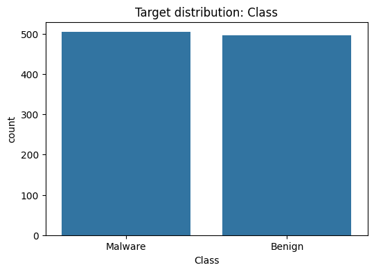

# Ransomware detection


<!-- WARNING: THIS FILE WAS AUTOGENERATED! DO NOT EDIT! -->

Este dataset contiene 21,752 muestras balanceadas, de las cuales 10,876
son maliciosas y 10,876 benignas. Las muestras maliciosas están
distribuidas en 26 familias distintas, incluyendo un enfoque particular
en ransomware, con familias reconocidas como Cerber, DarkSide, GandCrab,
Ryuk y WannaCry, entre otras.

El objetivo principal es entrenar modelos de clasificación capaces de
distinguir entre archivos maliciosos y benignos, evaluando su desempeño
mediante métricas como precisión, recall, f1-score y exactitud.

El dataset contiene características relevantes de cada archivo, que
serán procesadas, limpiadas y transformadas para generar los conjuntos
de entrenamiento y prueba. La variable objetivo es Class, que indica si
un archivo es malicioso (1) o benigno (0).

PLANNING: - INTRO - short dataset description. - EDA - shape, dtypes,
missing, class balance, sample rows, correlations. - PREPARING DATA -
drop useless columns, fix dtype issues, parse timestamps, coerce
numerics, encode label. - DATA SPLITTING - splitting training and
testing data. - RESULTS - early results. - PREPARING MODELS - prepare
hyperparameter, baseline models. - RESULTS WITH MULTIPLES MODELS-
metrics (precision/recall/f1), confusion matrix. - BALANCING - try
balancing and compare. - RESULTS (after balancing) - compare metrics. -
CONCLUSION - state best model, tradeoffs, next steps.

# EDA

## Importamos las librerías necesarias y cargamos el dataset

``` python
import pandas as pd
from pathlib import Path

base_dir = Path.cwd()
csv_file_path = base_dir.parent.parent / "data" / "raw_data" / "ransom.csv"
data = pd.read_csv(csv_file_path, low_memory=False, index_col=0)
# Para hacer más rápido el procesamiento, tomamos una muestra del dataset
df = data.sample(n=1000, random_state=42)
df.head(1)
```

<div>
<style scoped>
    .dataframe tbody tr th:only-of-type {
        vertical-align: middle;
    }
&#10;    .dataframe tbody tr th {
        vertical-align: top;
    }
&#10;    .dataframe thead th {
        text-align: right;
    }
</style>

<table class="dataframe" data-quarto-postprocess="true" data-border="1">
<thead>
<tr style="text-align: right;">
<th data-quarto-table-cell-role="th"></th>
<th data-quarto-table-cell-role="th">sha1</th>
<th data-quarto-table-cell-role="th">file_extension</th>
<th data-quarto-table-cell-role="th">EntryPoint</th>
<th data-quarto-table-cell-role="th">PEType</th>
<th data-quarto-table-cell-role="th">MachineType</th>
<th data-quarto-table-cell-role="th">magic_number</th>
<th data-quarto-table-cell-role="th">bytes_on_last_page</th>
<th data-quarto-table-cell-role="th">pages_in_file</th>
<th data-quarto-table-cell-role="th">relocations</th>
<th data-quarto-table-cell-role="th">size_of_header</th>
<th data-quarto-table-cell-role="th">...</th>
<th data-quarto-table-cell-role="th">total_procsses</th>
<th data-quarto-table-cell-role="th">files_malicious</th>
<th data-quarto-table-cell-role="th">files_suspicious</th>
<th data-quarto-table-cell-role="th">files_text</th>
<th data-quarto-table-cell-role="th">files_unknown</th>
<th data-quarto-table-cell-role="th">dlls_calls</th>
<th data-quarto-table-cell-role="th">apis</th>
<th data-quarto-table-cell-role="th">Class</th>
<th data-quarto-table-cell-role="th">Category</th>
<th data-quarto-table-cell-role="th">Family</th>
</tr>
<tr>
<th data-quarto-table-cell-role="th">md5</th>
<th data-quarto-table-cell-role="th"></th>
<th data-quarto-table-cell-role="th"></th>
<th data-quarto-table-cell-role="th"></th>
<th data-quarto-table-cell-role="th"></th>
<th data-quarto-table-cell-role="th"></th>
<th data-quarto-table-cell-role="th"></th>
<th data-quarto-table-cell-role="th"></th>
<th data-quarto-table-cell-role="th"></th>
<th data-quarto-table-cell-role="th"></th>
<th data-quarto-table-cell-role="th"></th>
<th data-quarto-table-cell-role="th"></th>
<th data-quarto-table-cell-role="th"></th>
<th data-quarto-table-cell-role="th"></th>
<th data-quarto-table-cell-role="th"></th>
<th data-quarto-table-cell-role="th"></th>
<th data-quarto-table-cell-role="th"></th>
<th data-quarto-table-cell-role="th"></th>
<th data-quarto-table-cell-role="th"></th>
<th data-quarto-table-cell-role="th"></th>
<th data-quarto-table-cell-role="th"></th>
<th data-quarto-table-cell-role="th"></th>
</tr>
</thead>
<tbody>
<tr>
<td
data-quarto-table-cell-role="th">8742c015240d3807cda31988658f2b80</td>
<td>7e89a31bbcbc780f3e2adc777995501f86079d6e</td>
<td>exe</td>
<td>0x34a4</td>
<td>PE32</td>
<td>Intel 386 or later, and compatibles</td>
<td>MZ</td>
<td>0x0090</td>
<td>0x0003</td>
<td>0x0004</td>
<td>0x0000</td>
<td>...</td>
<td>36.0</td>
<td>0.0</td>
<td>0.0</td>
<td>0.0</td>
<td>0.0</td>
<td>0.0</td>
<td>0.0</td>
<td>Benign</td>
<td>Benign</td>
<td>Benign</td>
</tr>
</tbody>
</table>

<p>1 rows × 76 columns</p>
</div>

## Realizamos un analisis exploratorio sobre los datos

### Exploramos la forma general del dataset

``` python
# Realizamos un analysis exploratorio sobre los datos
print("Shape:", df.shape)
print("\nColumns and dtypes:")
print(df.dtypes)
print("\nNumeric summary (describe):")
display(df.describe().T)
```

    Shape: (1000, 76)

    Columns and dtypes:
    sha1               object
    file_extension     object
    EntryPoint         object
    PEType             object
    MachineType        object
                       ...   
    dlls_calls        float64
    apis              float64
    Class              object
    Category           object
    Family             object
    Length: 76, dtype: object

    Numeric summary (describe):

<div>
<style scoped>
    .dataframe tbody tr th:only-of-type {
        vertical-align: middle;
    }
&#10;    .dataframe tbody tr th {
        vertical-align: top;
    }
&#10;    .dataframe thead th {
        text-align: right;
    }
</style>

<table class="dataframe" data-quarto-postprocess="true" data-border="1">
<thead>
<tr style="text-align: right;">
<th data-quarto-table-cell-role="th"></th>
<th data-quarto-table-cell-role="th">count</th>
<th data-quarto-table-cell-role="th">mean</th>
<th data-quarto-table-cell-role="th">std</th>
<th data-quarto-table-cell-role="th">min</th>
<th data-quarto-table-cell-role="th">25%</th>
<th data-quarto-table-cell-role="th">50%</th>
<th data-quarto-table-cell-role="th">75%</th>
<th data-quarto-table-cell-role="th">max</th>
</tr>
</thead>
<tbody>
<tr>
<td data-quarto-table-cell-role="th">registry_read</td>
<td>1000.0</td>
<td>1969.901</td>
<td>12792.143237</td>
<td>0.0</td>
<td>23.00</td>
<td>213.5</td>
<td>898.25</td>
<td>359646.0</td>
</tr>
<tr>
<td data-quarto-table-cell-role="th">registry_write</td>
<td>1000.0</td>
<td>15.826</td>
<td>84.838194</td>
<td>0.0</td>
<td>0.00</td>
<td>0.0</td>
<td>3.00</td>
<td>1448.0</td>
</tr>
<tr>
<td data-quarto-table-cell-role="th">registry_delete</td>
<td>1000.0</td>
<td>1.908</td>
<td>18.058284</td>
<td>0.0</td>
<td>0.00</td>
<td>0.0</td>
<td>0.00</td>
<td>298.0</td>
</tr>
<tr>
<td data-quarto-table-cell-role="th">registry_total</td>
<td>1000.0</td>
<td>2063.848</td>
<td>13027.855054</td>
<td>0.0</td>
<td>22.75</td>
<td>221.0</td>
<td>918.75</td>
<td>365999.0</td>
</tr>
<tr>
<td data-quarto-table-cell-role="th">network_threats</td>
<td>1000.0</td>
<td>0.000</td>
<td>0.000000</td>
<td>0.0</td>
<td>0.00</td>
<td>0.0</td>
<td>0.00</td>
<td>0.0</td>
</tr>
<tr>
<td data-quarto-table-cell-role="th">network_dns</td>
<td>1000.0</td>
<td>4.134</td>
<td>27.120538</td>
<td>0.0</td>
<td>0.00</td>
<td>0.0</td>
<td>1.00</td>
<td>568.0</td>
</tr>
<tr>
<td data-quarto-table-cell-role="th">network_http</td>
<td>1000.0</td>
<td>1.675</td>
<td>13.845543</td>
<td>0.0</td>
<td>0.00</td>
<td>0.0</td>
<td>0.00</td>
<td>318.0</td>
</tr>
<tr>
<td data-quarto-table-cell-role="th">network_connections</td>
<td>1000.0</td>
<td>21.927</td>
<td>174.432217</td>
<td>0.0</td>
<td>0.00</td>
<td>2.0</td>
<td>5.00</td>
<td>2192.0</td>
</tr>
<tr>
<td data-quarto-table-cell-role="th">processes_malicious</td>
<td>1000.0</td>
<td>1.835</td>
<td>10.217151</td>
<td>0.0</td>
<td>0.00</td>
<td>1.0</td>
<td>2.00</td>
<td>314.0</td>
</tr>
<tr>
<td data-quarto-table-cell-role="th">processes_suspicious</td>
<td>1000.0</td>
<td>0.359</td>
<td>2.548846</td>
<td>0.0</td>
<td>0.00</td>
<td>0.0</td>
<td>0.00</td>
<td>70.0</td>
</tr>
<tr>
<td data-quarto-table-cell-role="th">processes_monitored</td>
<td>1000.0</td>
<td>9.437</td>
<td>54.572192</td>
<td>0.0</td>
<td>1.00</td>
<td>2.0</td>
<td>5.00</td>
<td>1605.0</td>
</tr>
<tr>
<td data-quarto-table-cell-role="th">total_procsses</td>
<td>1000.0</td>
<td>42.929</td>
<td>58.420929</td>
<td>0.0</td>
<td>34.00</td>
<td>37.0</td>
<td>43.00</td>
<td>1643.0</td>
</tr>
<tr>
<td data-quarto-table-cell-role="th">files_malicious</td>
<td>1000.0</td>
<td>5.892</td>
<td>30.643815</td>
<td>0.0</td>
<td>0.00</td>
<td>0.0</td>
<td>1.00</td>
<td>551.0</td>
</tr>
<tr>
<td data-quarto-table-cell-role="th">files_suspicious</td>
<td>1000.0</td>
<td>359.543</td>
<td>2003.727509</td>
<td>0.0</td>
<td>0.00</td>
<td>0.0</td>
<td>4.00</td>
<td>34060.0</td>
</tr>
<tr>
<td data-quarto-table-cell-role="th">files_text</td>
<td>1000.0</td>
<td>71.734</td>
<td>331.357745</td>
<td>0.0</td>
<td>0.00</td>
<td>0.0</td>
<td>3.00</td>
<td>5947.0</td>
</tr>
<tr>
<td data-quarto-table-cell-role="th">files_unknown</td>
<td>1000.0</td>
<td>23.166</td>
<td>167.367082</td>
<td>0.0</td>
<td>0.00</td>
<td>0.0</td>
<td>0.00</td>
<td>4415.0</td>
</tr>
<tr>
<td data-quarto-table-cell-role="th">dlls_calls</td>
<td>1000.0</td>
<td>4.591</td>
<td>5.780236</td>
<td>0.0</td>
<td>1.00</td>
<td>2.0</td>
<td>7.00</td>
<td>50.0</td>
</tr>
<tr>
<td data-quarto-table-cell-role="th">apis</td>
<td>1000.0</td>
<td>91.538</td>
<td>138.579663</td>
<td>0.0</td>
<td>1.00</td>
<td>23.0</td>
<td>127.00</td>
<td>953.0</td>
</tr>
</tbody>
</table>

</div>

### Verificamos valores nulos

``` python
# Resumen de valores nulos

missing_counts = df.isna().sum()
missing_percent = 100 * missing_counts / len(df)
missing_summary = pd.concat([missing_counts, missing_percent], axis=1)
missing_summary.columns = ["nulos", "porcentaje"]
print("\nNulos por columna (n y %):")
display(missing_summary.sort_values("nulos", ascending=False).head(20))
```


    Nulos por columna (n y %):

<div>
<style scoped>
    .dataframe tbody tr th:only-of-type {
        vertical-align: middle;
    }
&#10;    .dataframe tbody tr th {
        vertical-align: top;
    }
&#10;    .dataframe thead th {
        text-align: right;
    }
</style>

<table class="dataframe" data-quarto-postprocess="true" data-border="1">
<thead>
<tr style="text-align: right;">
<th data-quarto-table-cell-role="th"></th>
<th data-quarto-table-cell-role="th">nulos</th>
<th data-quarto-table-cell-role="th">porcentaje</th>
</tr>
</thead>
<tbody>
<tr>
<td data-quarto-table-cell-role="th">sha1</td>
<td>0</td>
<td>0.0</td>
</tr>
<tr>
<td data-quarto-table-cell-role="th">file_extension</td>
<td>0</td>
<td>0.0</td>
</tr>
<tr>
<td data-quarto-table-cell-role="th">EntryPoint</td>
<td>0</td>
<td>0.0</td>
</tr>
<tr>
<td data-quarto-table-cell-role="th">PEType</td>
<td>0</td>
<td>0.0</td>
</tr>
<tr>
<td data-quarto-table-cell-role="th">MachineType</td>
<td>0</td>
<td>0.0</td>
</tr>
<tr>
<td data-quarto-table-cell-role="th">magic_number</td>
<td>0</td>
<td>0.0</td>
</tr>
<tr>
<td data-quarto-table-cell-role="th">bytes_on_last_page</td>
<td>0</td>
<td>0.0</td>
</tr>
<tr>
<td data-quarto-table-cell-role="th">pages_in_file</td>
<td>0</td>
<td>0.0</td>
</tr>
<tr>
<td data-quarto-table-cell-role="th">relocations</td>
<td>0</td>
<td>0.0</td>
</tr>
<tr>
<td data-quarto-table-cell-role="th">size_of_header</td>
<td>0</td>
<td>0.0</td>
</tr>
<tr>
<td data-quarto-table-cell-role="th">min_extra_paragraphs</td>
<td>0</td>
<td>0.0</td>
</tr>
<tr>
<td data-quarto-table-cell-role="th">max_extra_paragraphs</td>
<td>0</td>
<td>0.0</td>
</tr>
<tr>
<td data-quarto-table-cell-role="th">init_ss_value</td>
<td>0</td>
<td>0.0</td>
</tr>
<tr>
<td data-quarto-table-cell-role="th">init_sp_value</td>
<td>0</td>
<td>0.0</td>
</tr>
<tr>
<td data-quarto-table-cell-role="th">init_ip_value</td>
<td>0</td>
<td>0.0</td>
</tr>
<tr>
<td data-quarto-table-cell-role="th">init_cs_value</td>
<td>0</td>
<td>0.0</td>
</tr>
<tr>
<td data-quarto-table-cell-role="th">over_lay_number</td>
<td>0</td>
<td>0.0</td>
</tr>
<tr>
<td data-quarto-table-cell-role="th">oem_identifier</td>
<td>0</td>
<td>0.0</td>
</tr>
<tr>
<td data-quarto-table-cell-role="th">address_of_ne_header</td>
<td>0</td>
<td>0.0</td>
</tr>
<tr>
<td data-quarto-table-cell-role="th">Magic</td>
<td>0</td>
<td>0.0</td>
</tr>
</tbody>
</table>

</div>

Revisamos su distribution

``` python
import matplotlib.pyplot as plt
import seaborn as sns

target_col = "Class"
figsize = (6, 4)

# Muestra los conteos y porcentajes para la variable binaria objetivo

vc = df[target_col].value_counts(dropna=False)
pct = (vc / len(df) * 100).round(2)
print("Counts:")
print(vc)
print("\nPercent:")
print(pct)

plt.figure(figsize=figsize)
sns.barplot(x=vc.index.astype(str), y=vc.values)
plt.title(f"Target distribution: {target_col}")
plt.ylabel("count")
plt.xlabel(target_col)
plt.show()
```

    Counts:
    Class
    Malware    504
    Benign     496
    Name: count, dtype: int64

    Percent:
    Class
    Malware    50.4
    Benign     49.6
    Name: count, dtype: float64



# PREPARING DATA

``` python
# Hacemos una copia del DataFrame original para no modificar el raw
df_clean = df.copy()

# Eliminamos filas con valores nulos
df_clean = df_clean.dropna()

# Verificamos que no queden valores únicos
df_clean.nunique().sort_values()

# Quitamos espacios en los nombres de las columnas
df_clean.columns = df_clean.columns.str.strip()

# Analizamos el tipo de columnas en busca de columnas que no sean numéricas o apropiadas para el análisis
df_clean.keys()
```

    Index(['sha1', 'file_extension', 'EntryPoint', 'PEType', 'MachineType',
           'magic_number', 'bytes_on_last_page', 'pages_in_file', 'relocations',
           'size_of_header', 'min_extra_paragraphs', 'max_extra_paragraphs',
           'init_ss_value', 'init_sp_value', 'init_ip_value', 'init_cs_value',
           'over_lay_number', 'oem_identifier', 'address_of_ne_header', 'Magic',
           'SizeOfCode', 'SizeOfInitializedData', 'SizeOfUninitializedData',
           'AddressOfEntryPoint', 'BaseOfCode', 'BaseOfData', 'ImageBase',
           'SectionAlignment', 'FileAlignment', 'OperatingSystemVersion',
           'ImageVersion', 'SizeOfImage', 'SizeOfHeaders', 'Checksum', 'Subsystem',
           'DllCharacteristics', 'SizeofStackReserve', 'SizeofStackCommit',
           'SizeofHeapCommit', 'SizeofHeapReserve', 'LoaderFlags',
           'text_VirtualSize', 'text_VirtualAddress', 'text_SizeOfRawData',
           'text_PointerToRawData', 'text_PointerToRelocations',
           'text_PointerToLineNumbers', 'text_Characteristics',
           'rdata_VirtualSize', 'rdata_VirtualAddress', 'rdata_SizeOfRawData',
           'rdata_PointerToRawData', 'rdata_PointerToRelocations',
           'rdata_PointerToLineNumbers', 'rdata_Characteristics', 'registry_read',
           'registry_write', 'registry_delete', 'registry_total',
           'network_threats', 'network_dns', 'network_http', 'network_connections',
           'processes_malicious', 'processes_suspicious', 'processes_monitored',
           'total_procsses', 'files_malicious', 'files_suspicious', 'files_text',
           'files_unknown', 'dlls_calls', 'apis', 'Class', 'Category', 'Family'],
          dtype='object')

``` python
# Eliminamos columnas irrelevantes
cols_to_drop = ["sha1", "Family", "Category", "over_lay_number", "oem_identifier", "LoaderFlags"]
df_clean = df_clean.drop(columns=cols_to_drop)
```

``` python
# Revisar columnas constantes
constant_cols = [c for c in df_clean.columns if df_clean[c].nunique() <= 1]
print("Constant columns:", constant_cols)
```

    Constant columns: ['file_extension', 'network_threats']

``` python
# Verificamos columna seleccionada como constante, si solo existe un valor único, no aporta información.
df_clean["file_extension"].unique()
```

    array(['exe'], dtype=object)

``` python
df_clean["network_threats"].unique()
```

    array([0.])

``` python
# Quitamos columnas constantes
df_clean = df_clean.drop(columns=constant_cols)
```

``` python
# Verificamos columnas duplicadas
duplicates = df_clean.T.duplicated()
df_clean.columns[duplicates]
```

    Index([], dtype='object')

``` python
# Revisar tipos y columnas mixtas
df_clean.dtypes.value_counts()
```

    object     51
    float64    17
    Name: count, dtype: int64

``` python
# luego de observar los datos, nos damos cuenta hay columnas con valores muy similares
# por ejemplo, PEType y Magic, con 953 valores iguales
print(df_clean["PEType"].head(10))
print("valores similares: ", (df_clean["PEType"] == df_clean["Magic"]).sum())
```

    md5
    8742c015240d3807cda31988658f2b80    PE32
    f3d8ec0bb4938b0fdeb792bc789ca847    PE32
    626b2ce2612e2d1c2ee19be8a3164869    PE32
    c0e5b07cbf2d02c54f39ce6aad676dc7    PE32
    09edf4631cf47c828e1db9e2868f7861    PE32
    e3a7589242aabce2f79f41e8cdcedba4    PE32
    1bf3bc274de270da4b1b577205f2f57e    PE32
    6e46073c0e1b82d9f376ac35b193431c    PE32
    d996b078e1d0d20f86e2b5f7ce09fdb3    PE32
    cb6f7aa8475416055d6a363c4c0617dd    PE32
    Name: PEType, dtype: object
    valores similares:  953

``` python
# Función de utilidad para encontrar columnas redundantes
# Imprime pares de columnas con alta similitud (por defecto, 90% iguales)
# Devuelve una lista de columnas redundantes (a eliminar)
# siempre se queda con la primera columna del par

import itertools

def get_redundant_columns(df, threshold=0.9):
    n = len(df)
    redundant_cols = set()

    for col1, col2 in itertools.combinations(df.columns, 2):
        equal_count = (df[col1] == df[col2]).sum()
        similarity = equal_count / n

        if similarity >= threshold:
            print(f"{col1} ~ {col2} > {similarity:.2%} iguales")
            # Marca col2 como redundante (se elimina)
            redundant_cols.add(col2)

    return list(redundant_cols)


# Detectar redundantes
redundant_cols = get_redundant_columns(df_clean, threshold=0.9)
```

    PEType ~ Magic > 95.30% iguales
    relocations ~ min_extra_paragraphs > 93.30% iguales
    relocations ~ init_ss_value > 98.40% iguales
    relocations ~ init_ip_value > 97.90% iguales
    relocations ~ init_cs_value > 98.30% iguales
    min_extra_paragraphs ~ init_ss_value > 94.20% iguales
    min_extra_paragraphs ~ init_ip_value > 93.80% iguales
    min_extra_paragraphs ~ init_cs_value > 94.10% iguales
    init_ss_value ~ init_ip_value > 98.90% iguales
    init_ss_value ~ init_cs_value > 99.30% iguales
    init_ip_value ~ init_cs_value > 98.90% iguales
    BaseOfCode ~ SectionAlignment > 90.70% iguales
    text_PointerToRelocations ~ text_PointerToLineNumbers > 99.40% iguales
    text_PointerToRelocations ~ rdata_PointerToRelocations > 94.40% iguales
    text_PointerToRelocations ~ rdata_PointerToLineNumbers > 94.60% iguales
    text_PointerToLineNumbers ~ rdata_PointerToRelocations > 94.50% iguales
    text_PointerToLineNumbers ~ rdata_PointerToLineNumbers > 94.60% iguales
    rdata_PointerToRelocations ~ rdata_PointerToLineNumbers > 99.40% iguales

``` python
print("\nColumnas redundantes a eliminar:", redundant_cols)
```


    Columnas redundantes a eliminar: ['init_cs_value', 'init_ip_value', 'init_ss_value', 'rdata_PointerToRelocations', 'text_PointerToLineNumbers', 'rdata_PointerToLineNumbers', 'Magic', 'min_extra_paragraphs', 'SectionAlignment']

``` python
# Eliminar redundantes
df_clean = df_clean.drop(columns=redundant_cols)
```

``` python
import pandas as pd

def low_cardinality_check(df, target='Class', threshold=5):
    """
    Revisa columnas con pocos valores únicos y cómo se relacionan con la clase.
    
    Args:
        df: DataFrame
        target: columna objetivo (class)
        threshold: máximo número de valores únicos para considerar baja cardinalidad
    """
    low_card_cols = [col for col in df.columns if df[col].nunique() <= threshold and col != target]
    
    for col in low_card_cols:
        print(f"\nColumna: {col} | Valores únicos: {df[col].nunique()}")
        print(pd.crosstab(df[col], df[target]))
        
        # Señal simple: si un valor domina >90% de la columna, candidata a eliminar
        top_ratio = df[col].value_counts(normalize=True).iloc[0]
        if top_ratio > 0.9:
            print(f"⚠️ Candidata a eliminar (valor dominante {top_ratio:.2%})")
        else:
            print("✅ Mantener, puede ser informativa")

# Uso
low_cardinality_check(df_clean, target='Class', threshold=3)
```


    Columna: PEType | Valores únicos: 2
    Class   Benign  Malware
    PEType                 
    PE32       391      499
    PE32+      105        5
    ✅ Mantener, puede ser informativa

    Columna: MachineType | Valores únicos: 3
    Class                                Benign  Malware
    MachineType                                         
    AMD AMD64                                98        5
    Intel 386 or later, and compatibles     397      499
    Unknown (0)                               1        0
    ✅ Mantener, puede ser informativa

    Columna: magic_number | Valores únicos: 2
    Class         Benign  Malware
    magic_number                 
    0                  0       24
    MZ               496      480
    ⚠️ Candidata a eliminar (valor dominante 97.60%)

``` python
df_clean = df_clean.drop(columns=["magic_number"])
```

``` python
def convert_hex_columns(df):
    for col in df.columns:
        if df[col].dtype == object:
            def try_convert(x):
                try:
                    return int(str(x), 16) if str(x).startswith("0x") else pd.to_numeric(x)
                except Exception as e:
                    return x
            df[col] = df[col].apply(try_convert)
            # Forzar tipo numérico si todos son números
            if pd.api.types.is_numeric_dtype(df[col]):
                df[col] = pd.to_numeric(df[col])
    return df

df_clean = convert_hex_columns(df_clean)
```

``` python
df_clean.dtypes.value_counts()
```

    int64      31
    float64    17
    object     10
    Name: count, dtype: int64

``` python
# Para identificar columnas no numéricas usamos:
df_clean.select_dtypes(include=['object']).columns.tolist()
```

    ['PEType',
     'MachineType',
     'AddressOfEntryPoint',
     'OperatingSystemVersion',
     'ImageVersion',
     'Subsystem',
     'DllCharacteristics',
     'text_Characteristics',
     'rdata_Characteristics',
     'Class']

``` python
# Creamos variables dummy para la columna PEType, utilizando one-hot encoding
peType = pd.get_dummies(df_clean["PEType"], dtype=int)
df_clean = pd.concat([df_clean, peType], axis=1)
df_clean = df_clean.drop(columns=["PEType"])
```

``` python
df_clean["MachineType"].unique()
```

    array(['Intel 386 or later, and compatibles', 'AMD AMD64', 'Unknown (0)'],
          dtype=object)

``` python
machineType = pd.get_dummies(df_clean["MachineType"], dtype=int)
df_clean = pd.concat([df_clean, machineType], axis=1)
df_clean = df_clean.drop(columns=["MachineType"])
```

``` python
df_clean["AddressOfEntryPoint"].unique()
df_clean = df_clean.drop(columns=["AddressOfEntryPoint"])
```

``` python
df_clean["OperatingSystemVersion"] = pd.to_numeric(df_clean["OperatingSystemVersion"], errors="coerce") 
df_clean["ImageVersion"] = pd.to_numeric(df_clean["ImageVersion"], errors="coerce")
```

``` python
df_clean["Subsystem"].unique()
```

    array(['IMAGE_SUBSYSTEM_WINDOWS_CUI', 'IMAGE_SUBSYSTEM_WINDOWS_GUI',
           np.int64(0), 'IMAGE_SUBSYSTEM_NATIVE', 'IMAGE_SUBSYSTEM_UNKNOWN'],
          dtype=object)

``` python
subsystem = pd.get_dummies(df_clean["Subsystem"], dtype=int)
df_clean = pd.concat([df_clean, subsystem], axis=1)
df_clean = df_clean.drop(columns=["Subsystem"])
```

``` python
df_clean["DllCharacteristics"].unique()
df_clean = df_clean.drop(columns=["DllCharacteristics"])
```

``` python
df_clean["text_Characteristics"].unique()
df_clean = df_clean.drop(columns=["text_Characteristics"])
```

``` python
df_clean["rdata_Characteristics"].unique()
df_clean = df_clean.drop(columns=["rdata_Characteristics"])
```

``` python
# Reordenamos las columnas para que la variable objetivo quede al final, lo cual es una buena práctica
col = df_clean.pop("Class")
df_clean["Class"] = col
```

``` python
# nuestro dataset limpio
df_clean.info()
```

    <class 'pandas.core.frame.DataFrame'>
    Index: 1000 entries, 8742c015240d3807cda31988658f2b80 to 0ede6a9e975bbc0f20629ccfac7db0d1
    Data columns (total 61 columns):
     #   Column                               Non-Null Count  Dtype  
    ---  ------                               --------------  -----  
     0   EntryPoint                           1000 non-null   int64  
     1   bytes_on_last_page                   1000 non-null   int64  
     2   pages_in_file                        1000 non-null   int64  
     3   relocations                          1000 non-null   int64  
     4   size_of_header                       1000 non-null   int64  
     5   max_extra_paragraphs                 1000 non-null   int64  
     6   init_sp_value                        1000 non-null   int64  
     7   address_of_ne_header                 1000 non-null   int64  
     8   SizeOfCode                           1000 non-null   int64  
     9   SizeOfInitializedData                1000 non-null   int64  
     10  SizeOfUninitializedData              1000 non-null   int64  
     11  BaseOfCode                           1000 non-null   int64  
     12  BaseOfData                           1000 non-null   int64  
     13  ImageBase                            1000 non-null   int64  
     14  FileAlignment                        1000 non-null   int64  
     15  OperatingSystemVersion               986 non-null    float64
     16  ImageVersion                         981 non-null    float64
     17  SizeOfImage                          1000 non-null   int64  
     18  SizeOfHeaders                        1000 non-null   int64  
     19  Checksum                             1000 non-null   int64  
     20  SizeofStackReserve                   1000 non-null   int64  
     21  SizeofStackCommit                    1000 non-null   int64  
     22  SizeofHeapCommit                     1000 non-null   int64  
     23  SizeofHeapReserve                    1000 non-null   int64  
     24  text_VirtualSize                     1000 non-null   int64  
     25  text_VirtualAddress                  1000 non-null   int64  
     26  text_SizeOfRawData                   1000 non-null   int64  
     27  text_PointerToRawData                1000 non-null   int64  
     28  text_PointerToRelocations            1000 non-null   int64  
     29  rdata_VirtualSize                    1000 non-null   int64  
     30  rdata_VirtualAddress                 1000 non-null   int64  
     31  rdata_SizeOfRawData                  1000 non-null   int64  
     32  rdata_PointerToRawData               1000 non-null   int64  
     33  registry_read                        1000 non-null   float64
     34  registry_write                       1000 non-null   float64
     35  registry_delete                      1000 non-null   float64
     36  registry_total                       1000 non-null   float64
     37  network_dns                          1000 non-null   float64
     38  network_http                         1000 non-null   float64
     39  network_connections                  1000 non-null   float64
     40  processes_malicious                  1000 non-null   float64
     41  processes_suspicious                 1000 non-null   float64
     42  processes_monitored                  1000 non-null   float64
     43  total_procsses                       1000 non-null   float64
     44  files_malicious                      1000 non-null   float64
     45  files_suspicious                     1000 non-null   float64
     46  files_text                           1000 non-null   float64
     47  files_unknown                        1000 non-null   float64
     48  dlls_calls                           1000 non-null   float64
     49  apis                                 1000 non-null   float64
     50  PE32                                 1000 non-null   int64  
     51  PE32+                                1000 non-null   int64  
     52  AMD AMD64                            1000 non-null   int64  
     53  Intel 386 or later, and compatibles  1000 non-null   int64  
     54  Unknown (0)                          1000 non-null   int64  
     55  0                                    1000 non-null   int64  
     56  IMAGE_SUBSYSTEM_NATIVE               1000 non-null   int64  
     57  IMAGE_SUBSYSTEM_UNKNOWN              1000 non-null   int64  
     58  IMAGE_SUBSYSTEM_WINDOWS_CUI          1000 non-null   int64  
     59  IMAGE_SUBSYSTEM_WINDOWS_GUI          1000 non-null   int64  
     60  Class                                1000 non-null   object 
    dtypes: float64(19), int64(41), object(1)
    memory usage: 516.7+ KB

``` python
df_clean.head(5)
```

<div>
<style scoped>
    .dataframe tbody tr th:only-of-type {
        vertical-align: middle;
    }
&#10;    .dataframe tbody tr th {
        vertical-align: top;
    }
&#10;    .dataframe thead th {
        text-align: right;
    }
</style>

<table class="dataframe" data-quarto-postprocess="true" data-border="1">
<thead>
<tr style="text-align: right;">
<th data-quarto-table-cell-role="th"></th>
<th data-quarto-table-cell-role="th">EntryPoint</th>
<th data-quarto-table-cell-role="th">bytes_on_last_page</th>
<th data-quarto-table-cell-role="th">pages_in_file</th>
<th data-quarto-table-cell-role="th">relocations</th>
<th data-quarto-table-cell-role="th">size_of_header</th>
<th data-quarto-table-cell-role="th">max_extra_paragraphs</th>
<th data-quarto-table-cell-role="th">init_sp_value</th>
<th data-quarto-table-cell-role="th">address_of_ne_header</th>
<th data-quarto-table-cell-role="th">SizeOfCode</th>
<th data-quarto-table-cell-role="th">SizeOfInitializedData</th>
<th data-quarto-table-cell-role="th">...</th>
<th data-quarto-table-cell-role="th">PE32+</th>
<th data-quarto-table-cell-role="th">AMD AMD64</th>
<th data-quarto-table-cell-role="th">Intel 386 or later, and
compatibles</th>
<th data-quarto-table-cell-role="th">Unknown (0)</th>
<th data-quarto-table-cell-role="th">0</th>
<th data-quarto-table-cell-role="th">IMAGE_SUBSYSTEM_NATIVE</th>
<th data-quarto-table-cell-role="th">IMAGE_SUBSYSTEM_UNKNOWN</th>
<th data-quarto-table-cell-role="th">IMAGE_SUBSYSTEM_WINDOWS_CUI</th>
<th data-quarto-table-cell-role="th">IMAGE_SUBSYSTEM_WINDOWS_GUI</th>
<th data-quarto-table-cell-role="th">Class</th>
</tr>
<tr>
<th data-quarto-table-cell-role="th">md5</th>
<th data-quarto-table-cell-role="th"></th>
<th data-quarto-table-cell-role="th"></th>
<th data-quarto-table-cell-role="th"></th>
<th data-quarto-table-cell-role="th"></th>
<th data-quarto-table-cell-role="th"></th>
<th data-quarto-table-cell-role="th"></th>
<th data-quarto-table-cell-role="th"></th>
<th data-quarto-table-cell-role="th"></th>
<th data-quarto-table-cell-role="th"></th>
<th data-quarto-table-cell-role="th"></th>
<th data-quarto-table-cell-role="th"></th>
<th data-quarto-table-cell-role="th"></th>
<th data-quarto-table-cell-role="th"></th>
<th data-quarto-table-cell-role="th"></th>
<th data-quarto-table-cell-role="th"></th>
<th data-quarto-table-cell-role="th"></th>
<th data-quarto-table-cell-role="th"></th>
<th data-quarto-table-cell-role="th"></th>
<th data-quarto-table-cell-role="th"></th>
<th data-quarto-table-cell-role="th"></th>
<th data-quarto-table-cell-role="th"></th>
</tr>
</thead>
<tbody>
<tr>
<td
data-quarto-table-cell-role="th">8742c015240d3807cda31988658f2b80</td>
<td>13476</td>
<td>144</td>
<td>3</td>
<td>4</td>
<td>0</td>
<td>65535</td>
<td>139</td>
<td>128</td>
<td>401408</td>
<td>4096</td>
<td>...</td>
<td>0</td>
<td>0</td>
<td>1</td>
<td>0</td>
<td>0</td>
<td>0</td>
<td>0</td>
<td>1</td>
<td>0</td>
<td>Benign</td>
</tr>
<tr>
<td
data-quarto-table-cell-role="th">f3d8ec0bb4938b0fdeb792bc789ca847</td>
<td>124818</td>
<td>144</td>
<td>3</td>
<td>0</td>
<td>4</td>
<td>65535</td>
<td>184</td>
<td>128</td>
<td>3964928</td>
<td>167936</td>
<td>...</td>
<td>0</td>
<td>0</td>
<td>1</td>
<td>0</td>
<td>0</td>
<td>0</td>
<td>0</td>
<td>0</td>
<td>1</td>
<td>Malware</td>
</tr>
<tr>
<td
data-quarto-table-cell-role="th">626b2ce2612e2d1c2ee19be8a3164869</td>
<td>12199</td>
<td>144</td>
<td>3</td>
<td>0</td>
<td>4</td>
<td>65535</td>
<td>184</td>
<td>224</td>
<td>34304</td>
<td>15872</td>
<td>...</td>
<td>0</td>
<td>0</td>
<td>1</td>
<td>0</td>
<td>0</td>
<td>0</td>
<td>0</td>
<td>0</td>
<td>1</td>
<td>Malware</td>
</tr>
<tr>
<td
data-quarto-table-cell-role="th">c0e5b07cbf2d02c54f39ce6aad676dc7</td>
<td>986856</td>
<td>80</td>
<td>2</td>
<td>0</td>
<td>4</td>
<td>65535</td>
<td>184</td>
<td>256</td>
<td>979968</td>
<td>926208</td>
<td>...</td>
<td>0</td>
<td>0</td>
<td>1</td>
<td>0</td>
<td>0</td>
<td>0</td>
<td>0</td>
<td>0</td>
<td>1</td>
<td>Benign</td>
</tr>
<tr>
<td
data-quarto-table-cell-role="th">09edf4631cf47c828e1db9e2868f7861</td>
<td>11252284</td>
<td>144</td>
<td>3</td>
<td>0</td>
<td>4</td>
<td>65535</td>
<td>184</td>
<td>128</td>
<td>4003328</td>
<td>3039232</td>
<td>...</td>
<td>0</td>
<td>0</td>
<td>1</td>
<td>0</td>
<td>0</td>
<td>0</td>
<td>0</td>
<td>0</td>
<td>1</td>
<td>Benign</td>
</tr>
</tbody>
</table>

<p>5 rows × 61 columns</p>
</div>

``` python
df_clean = df_clean.reset_index(drop=True)
```

``` python
df_clean.head(1)
```

<div>
<style scoped>
    .dataframe tbody tr th:only-of-type {
        vertical-align: middle;
    }
&#10;    .dataframe tbody tr th {
        vertical-align: top;
    }
&#10;    .dataframe thead th {
        text-align: right;
    }
</style>

<table class="dataframe" data-quarto-postprocess="true" data-border="1">
<thead>
<tr style="text-align: right;">
<th data-quarto-table-cell-role="th"></th>
<th data-quarto-table-cell-role="th">EntryPoint</th>
<th data-quarto-table-cell-role="th">bytes_on_last_page</th>
<th data-quarto-table-cell-role="th">pages_in_file</th>
<th data-quarto-table-cell-role="th">relocations</th>
<th data-quarto-table-cell-role="th">size_of_header</th>
<th data-quarto-table-cell-role="th">max_extra_paragraphs</th>
<th data-quarto-table-cell-role="th">init_sp_value</th>
<th data-quarto-table-cell-role="th">address_of_ne_header</th>
<th data-quarto-table-cell-role="th">SizeOfCode</th>
<th data-quarto-table-cell-role="th">SizeOfInitializedData</th>
<th data-quarto-table-cell-role="th">...</th>
<th data-quarto-table-cell-role="th">PE32+</th>
<th data-quarto-table-cell-role="th">AMD AMD64</th>
<th data-quarto-table-cell-role="th">Intel 386 or later, and
compatibles</th>
<th data-quarto-table-cell-role="th">Unknown (0)</th>
<th data-quarto-table-cell-role="th">0</th>
<th data-quarto-table-cell-role="th">IMAGE_SUBSYSTEM_NATIVE</th>
<th data-quarto-table-cell-role="th">IMAGE_SUBSYSTEM_UNKNOWN</th>
<th data-quarto-table-cell-role="th">IMAGE_SUBSYSTEM_WINDOWS_CUI</th>
<th data-quarto-table-cell-role="th">IMAGE_SUBSYSTEM_WINDOWS_GUI</th>
<th data-quarto-table-cell-role="th">Class</th>
</tr>
</thead>
<tbody>
<tr>
<td data-quarto-table-cell-role="th">0</td>
<td>13476</td>
<td>144</td>
<td>3</td>
<td>4</td>
<td>0</td>
<td>65535</td>
<td>139</td>
<td>128</td>
<td>401408</td>
<td>4096</td>
<td>...</td>
<td>0</td>
<td>0</td>
<td>1</td>
<td>0</td>
<td>0</td>
<td>0</td>
<td>0</td>
<td>1</td>
<td>0</td>
<td>Benign</td>
</tr>
</tbody>
</table>

<p>1 rows × 61 columns</p>
</div>

``` python
df_clean.isnull().sum().sum()
```

    np.int64(33)

``` python
df_clean = df_clean.dropna()
```

``` python
# finalmente solo necesitamos modificar la columna Class a valores binarios 0 y 1
df_clean["Class"] = df_clean["Class"].map({"Benign": 0, "Malware": 1})
```

# DATA SPLITTINGG

Separamos nuestro dataset en datos que serán usados para entrenamiento y
para testing

``` python
from sklearn.model_selection import train_test_split

X = df_clean.iloc[:,:-1].values
y = df_clean['Class'].values

X_train, X_test, y_train, y_test = train_test_split(X, y, test_size=.30, random_state=15, stratify=y)
```

``` python
X_train.shape, X_test.shape, y_train.shape, y_test.shape
```

    ((686, 60), (294, 60), (686,), (294,))

# RESULTS

Con todos los elementos necesarios, podemos realizar el entrenamiento y
predicción sobre el conjunto de datos.

``` python
# Realizamos el entrenamiento con un modelo de clasificación simple

from sklearn.neighbors import KNeighborsClassifier

clf = KNeighborsClassifier()

clf.fit(X_train, y_train)
```

<style>#sk-container-id-5 {
  /* Definition of color scheme common for light and dark mode */
  --sklearn-color-text: #000;
  --sklearn-color-text-muted: #666;
  --sklearn-color-line: gray;
  /* Definition of color scheme for unfitted estimators */
  --sklearn-color-unfitted-level-0: #fff5e6;
  --sklearn-color-unfitted-level-1: #f6e4d2;
  --sklearn-color-unfitted-level-2: #ffe0b3;
  --sklearn-color-unfitted-level-3: chocolate;
  /* Definition of color scheme for fitted estimators */
  --sklearn-color-fitted-level-0: #f0f8ff;
  --sklearn-color-fitted-level-1: #d4ebff;
  --sklearn-color-fitted-level-2: #b3dbfd;
  --sklearn-color-fitted-level-3: cornflowerblue;
&#10;  /* Specific color for light theme */
  --sklearn-color-text-on-default-background: var(--sg-text-color, var(--theme-code-foreground, var(--jp-content-font-color1, black)));
  --sklearn-color-background: var(--sg-background-color, var(--theme-background, var(--jp-layout-color0, white)));
  --sklearn-color-border-box: var(--sg-text-color, var(--theme-code-foreground, var(--jp-content-font-color1, black)));
  --sklearn-color-icon: #696969;
&#10;  @media (prefers-color-scheme: dark) {
    /* Redefinition of color scheme for dark theme */
    --sklearn-color-text-on-default-background: var(--sg-text-color, var(--theme-code-foreground, var(--jp-content-font-color1, white)));
    --sklearn-color-background: var(--sg-background-color, var(--theme-background, var(--jp-layout-color0, #111)));
    --sklearn-color-border-box: var(--sg-text-color, var(--theme-code-foreground, var(--jp-content-font-color1, white)));
    --sklearn-color-icon: #878787;
  }
}
&#10;#sk-container-id-5 {
  color: var(--sklearn-color-text);
}
&#10;#sk-container-id-5 pre {
  padding: 0;
}
&#10;#sk-container-id-5 input.sk-hidden--visually {
  border: 0;
  clip: rect(1px 1px 1px 1px);
  clip: rect(1px, 1px, 1px, 1px);
  height: 1px;
  margin: -1px;
  overflow: hidden;
  padding: 0;
  position: absolute;
  width: 1px;
}
&#10;#sk-container-id-5 div.sk-dashed-wrapped {
  border: 1px dashed var(--sklearn-color-line);
  margin: 0 0.4em 0.5em 0.4em;
  box-sizing: border-box;
  padding-bottom: 0.4em;
  background-color: var(--sklearn-color-background);
}
&#10;#sk-container-id-5 div.sk-container {
  /* jupyter's `normalize.less` sets `[hidden] { display: none; }`
     but bootstrap.min.css set `[hidden] { display: none !important; }`
     so we also need the `!important` here to be able to override the
     default hidden behavior on the sphinx rendered scikit-learn.org.
     See: https://github.com/scikit-learn/scikit-learn/issues/21755 */
  display: inline-block !important;
  position: relative;
}
&#10;#sk-container-id-5 div.sk-text-repr-fallback {
  display: none;
}
&#10;div.sk-parallel-item,
div.sk-serial,
div.sk-item {
  /* draw centered vertical line to link estimators */
  background-image: linear-gradient(var(--sklearn-color-text-on-default-background), var(--sklearn-color-text-on-default-background));
  background-size: 2px 100%;
  background-repeat: no-repeat;
  background-position: center center;
}
&#10;/* Parallel-specific style estimator block */
&#10;#sk-container-id-5 div.sk-parallel-item::after {
  content: "";
  width: 100%;
  border-bottom: 2px solid var(--sklearn-color-text-on-default-background);
  flex-grow: 1;
}
&#10;#sk-container-id-5 div.sk-parallel {
  display: flex;
  align-items: stretch;
  justify-content: center;
  background-color: var(--sklearn-color-background);
  position: relative;
}
&#10;#sk-container-id-5 div.sk-parallel-item {
  display: flex;
  flex-direction: column;
}
&#10;#sk-container-id-5 div.sk-parallel-item:first-child::after {
  align-self: flex-end;
  width: 50%;
}
&#10;#sk-container-id-5 div.sk-parallel-item:last-child::after {
  align-self: flex-start;
  width: 50%;
}
&#10;#sk-container-id-5 div.sk-parallel-item:only-child::after {
  width: 0;
}
&#10;/* Serial-specific style estimator block */
&#10;#sk-container-id-5 div.sk-serial {
  display: flex;
  flex-direction: column;
  align-items: center;
  background-color: var(--sklearn-color-background);
  padding-right: 1em;
  padding-left: 1em;
}
&#10;
/* Toggleable style: style used for estimator/Pipeline/ColumnTransformer box that is
clickable and can be expanded/collapsed.
- Pipeline and ColumnTransformer use this feature and define the default style
- Estimators will overwrite some part of the style using the `sk-estimator` class
*/
&#10;/* Pipeline and ColumnTransformer style (default) */
&#10;#sk-container-id-5 div.sk-toggleable {
  /* Default theme specific background. It is overwritten whether we have a
  specific estimator or a Pipeline/ColumnTransformer */
  background-color: var(--sklearn-color-background);
}
&#10;/* Toggleable label */
#sk-container-id-5 label.sk-toggleable__label {
  cursor: pointer;
  display: flex;
  width: 100%;
  margin-bottom: 0;
  padding: 0.5em;
  box-sizing: border-box;
  text-align: center;
  align-items: start;
  justify-content: space-between;
  gap: 0.5em;
}
&#10;#sk-container-id-5 label.sk-toggleable__label .caption {
  font-size: 0.6rem;
  font-weight: lighter;
  color: var(--sklearn-color-text-muted);
}
&#10;#sk-container-id-5 label.sk-toggleable__label-arrow:before {
  /* Arrow on the left of the label */
  content: "▸";
  float: left;
  margin-right: 0.25em;
  color: var(--sklearn-color-icon);
}
&#10;#sk-container-id-5 label.sk-toggleable__label-arrow:hover:before {
  color: var(--sklearn-color-text);
}
&#10;/* Toggleable content - dropdown */
&#10;#sk-container-id-5 div.sk-toggleable__content {
  display: none;
  text-align: left;
  /* unfitted */
  background-color: var(--sklearn-color-unfitted-level-0);
}
&#10;#sk-container-id-5 div.sk-toggleable__content.fitted {
  /* fitted */
  background-color: var(--sklearn-color-fitted-level-0);
}
&#10;#sk-container-id-5 div.sk-toggleable__content pre {
  margin: 0.2em;
  border-radius: 0.25em;
  color: var(--sklearn-color-text);
  /* unfitted */
  background-color: var(--sklearn-color-unfitted-level-0);
}
&#10;#sk-container-id-5 div.sk-toggleable__content.fitted pre {
  /* unfitted */
  background-color: var(--sklearn-color-fitted-level-0);
}
&#10;#sk-container-id-5 input.sk-toggleable__control:checked~div.sk-toggleable__content {
  /* Expand drop-down */
  display: block;
  width: 100%;
  overflow: visible;
}
&#10;#sk-container-id-5 input.sk-toggleable__control:checked~label.sk-toggleable__label-arrow:before {
  content: "▾";
}
&#10;/* Pipeline/ColumnTransformer-specific style */
&#10;#sk-container-id-5 div.sk-label input.sk-toggleable__control:checked~label.sk-toggleable__label {
  color: var(--sklearn-color-text);
  background-color: var(--sklearn-color-unfitted-level-2);
}
&#10;#sk-container-id-5 div.sk-label.fitted input.sk-toggleable__control:checked~label.sk-toggleable__label {
  background-color: var(--sklearn-color-fitted-level-2);
}
&#10;/* Estimator-specific style */
&#10;/* Colorize estimator box */
#sk-container-id-5 div.sk-estimator input.sk-toggleable__control:checked~label.sk-toggleable__label {
  /* unfitted */
  background-color: var(--sklearn-color-unfitted-level-2);
}
&#10;#sk-container-id-5 div.sk-estimator.fitted input.sk-toggleable__control:checked~label.sk-toggleable__label {
  /* fitted */
  background-color: var(--sklearn-color-fitted-level-2);
}
&#10;#sk-container-id-5 div.sk-label label.sk-toggleable__label,
#sk-container-id-5 div.sk-label label {
  /* The background is the default theme color */
  color: var(--sklearn-color-text-on-default-background);
}
&#10;/* On hover, darken the color of the background */
#sk-container-id-5 div.sk-label:hover label.sk-toggleable__label {
  color: var(--sklearn-color-text);
  background-color: var(--sklearn-color-unfitted-level-2);
}
&#10;/* Label box, darken color on hover, fitted */
#sk-container-id-5 div.sk-label.fitted:hover label.sk-toggleable__label.fitted {
  color: var(--sklearn-color-text);
  background-color: var(--sklearn-color-fitted-level-2);
}
&#10;/* Estimator label */
&#10;#sk-container-id-5 div.sk-label label {
  font-family: monospace;
  font-weight: bold;
  display: inline-block;
  line-height: 1.2em;
}
&#10;#sk-container-id-5 div.sk-label-container {
  text-align: center;
}
&#10;/* Estimator-specific */
#sk-container-id-5 div.sk-estimator {
  font-family: monospace;
  border: 1px dotted var(--sklearn-color-border-box);
  border-radius: 0.25em;
  box-sizing: border-box;
  margin-bottom: 0.5em;
  /* unfitted */
  background-color: var(--sklearn-color-unfitted-level-0);
}
&#10;#sk-container-id-5 div.sk-estimator.fitted {
  /* fitted */
  background-color: var(--sklearn-color-fitted-level-0);
}
&#10;/* on hover */
#sk-container-id-5 div.sk-estimator:hover {
  /* unfitted */
  background-color: var(--sklearn-color-unfitted-level-2);
}
&#10;#sk-container-id-5 div.sk-estimator.fitted:hover {
  /* fitted */
  background-color: var(--sklearn-color-fitted-level-2);
}
&#10;/* Specification for estimator info (e.g. "i" and "?") */
&#10;/* Common style for "i" and "?" */
&#10;.sk-estimator-doc-link,
a:link.sk-estimator-doc-link,
a:visited.sk-estimator-doc-link {
  float: right;
  font-size: smaller;
  line-height: 1em;
  font-family: monospace;
  background-color: var(--sklearn-color-background);
  border-radius: 1em;
  height: 1em;
  width: 1em;
  text-decoration: none !important;
  margin-left: 0.5em;
  text-align: center;
  /* unfitted */
  border: var(--sklearn-color-unfitted-level-1) 1pt solid;
  color: var(--sklearn-color-unfitted-level-1);
}
&#10;.sk-estimator-doc-link.fitted,
a:link.sk-estimator-doc-link.fitted,
a:visited.sk-estimator-doc-link.fitted {
  /* fitted */
  border: var(--sklearn-color-fitted-level-1) 1pt solid;
  color: var(--sklearn-color-fitted-level-1);
}
&#10;/* On hover */
div.sk-estimator:hover .sk-estimator-doc-link:hover,
.sk-estimator-doc-link:hover,
div.sk-label-container:hover .sk-estimator-doc-link:hover,
.sk-estimator-doc-link:hover {
  /* unfitted */
  background-color: var(--sklearn-color-unfitted-level-3);
  color: var(--sklearn-color-background);
  text-decoration: none;
}
&#10;div.sk-estimator.fitted:hover .sk-estimator-doc-link.fitted:hover,
.sk-estimator-doc-link.fitted:hover,
div.sk-label-container:hover .sk-estimator-doc-link.fitted:hover,
.sk-estimator-doc-link.fitted:hover {
  /* fitted */
  background-color: var(--sklearn-color-fitted-level-3);
  color: var(--sklearn-color-background);
  text-decoration: none;
}
&#10;/* Span, style for the box shown on hovering the info icon */
.sk-estimator-doc-link span {
  display: none;
  z-index: 9999;
  position: relative;
  font-weight: normal;
  right: .2ex;
  padding: .5ex;
  margin: .5ex;
  width: min-content;
  min-width: 20ex;
  max-width: 50ex;
  color: var(--sklearn-color-text);
  box-shadow: 2pt 2pt 4pt #999;
  /* unfitted */
  background: var(--sklearn-color-unfitted-level-0);
  border: .5pt solid var(--sklearn-color-unfitted-level-3);
}
&#10;.sk-estimator-doc-link.fitted span {
  /* fitted */
  background: var(--sklearn-color-fitted-level-0);
  border: var(--sklearn-color-fitted-level-3);
}
&#10;.sk-estimator-doc-link:hover span {
  display: block;
}
&#10;/* "?"-specific style due to the `<a>` HTML tag */
&#10;#sk-container-id-5 a.estimator_doc_link {
  float: right;
  font-size: 1rem;
  line-height: 1em;
  font-family: monospace;
  background-color: var(--sklearn-color-background);
  border-radius: 1rem;
  height: 1rem;
  width: 1rem;
  text-decoration: none;
  /* unfitted */
  color: var(--sklearn-color-unfitted-level-1);
  border: var(--sklearn-color-unfitted-level-1) 1pt solid;
}
&#10;#sk-container-id-5 a.estimator_doc_link.fitted {
  /* fitted */
  border: var(--sklearn-color-fitted-level-1) 1pt solid;
  color: var(--sklearn-color-fitted-level-1);
}
&#10;/* On hover */
#sk-container-id-5 a.estimator_doc_link:hover {
  /* unfitted */
  background-color: var(--sklearn-color-unfitted-level-3);
  color: var(--sklearn-color-background);
  text-decoration: none;
}
&#10;#sk-container-id-5 a.estimator_doc_link.fitted:hover {
  /* fitted */
  background-color: var(--sklearn-color-fitted-level-3);
}
&#10;.estimator-table summary {
    padding: .5rem;
    font-family: monospace;
    cursor: pointer;
}
&#10;.estimator-table details[open] {
    padding-left: 0.1rem;
    padding-right: 0.1rem;
    padding-bottom: 0.3rem;
}
&#10;.estimator-table .parameters-table {
    margin-left: auto !important;
    margin-right: auto !important;
}
&#10;.estimator-table .parameters-table tr:nth-child(odd) {
    background-color: #fff;
}
&#10;.estimator-table .parameters-table tr:nth-child(even) {
    background-color: #f6f6f6;
}
&#10;.estimator-table .parameters-table tr:hover {
    background-color: #e0e0e0;
}
&#10;.estimator-table table td {
    border: 1px solid rgba(106, 105, 104, 0.232);
}
&#10;.user-set td {
    color:rgb(255, 94, 0);
    text-align: left;
}
&#10;.user-set td.value pre {
    color:rgb(255, 94, 0) !important;
    background-color: transparent !important;
}
&#10;.default td {
    color: black;
    text-align: left;
}
&#10;.user-set td i,
.default td i {
    color: black;
}
&#10;.copy-paste-icon {
    background-image: url(data:image/svg+xml;base64,PHN2ZyB4bWxucz0iaHR0cDovL3d3dy53My5vcmcvMjAwMC9zdmciIHZpZXdCb3g9IjAgMCA0NDggNTEyIj48IS0tIUZvbnQgQXdlc29tZSBGcmVlIDYuNy4yIGJ5IEBmb250YXdlc29tZSAtIGh0dHBzOi8vZm9udGF3ZXNvbWUuY29tIExpY2Vuc2UgLSBodHRwczovL2ZvbnRhd2Vzb21lLmNvbS9saWNlbnNlL2ZyZWUgQ29weXJpZ2h0IDIwMjUgRm9udGljb25zLCBJbmMuLS0+PHBhdGggZD0iTTIwOCAwTDMzMi4xIDBjMTIuNyAwIDI0LjkgNS4xIDMzLjkgMTQuMWw2Ny45IDY3LjljOSA5IDE0LjEgMjEuMiAxNC4xIDMzLjlMNDQ4IDMzNmMwIDI2LjUtMjEuNSA0OC00OCA0OGwtMTkyIDBjLTI2LjUgMC00OC0yMS41LTQ4LTQ4bDAtMjg4YzAtMjYuNSAyMS41LTQ4IDQ4LTQ4ek00OCAxMjhsODAgMCAwIDY0LTY0IDAgMCAyNTYgMTkyIDAgMC0zMiA2NCAwIDAgNDhjMCAyNi41LTIxLjUgNDgtNDggNDhMNDggNTEyYy0yNi41IDAtNDgtMjEuNS00OC00OEwwIDE3NmMwLTI2LjUgMjEuNS00OCA0OC00OHoiLz48L3N2Zz4=);
    background-repeat: no-repeat;
    background-size: 14px 14px;
    background-position: 0;
    display: inline-block;
    width: 14px;
    height: 14px;
    cursor: pointer;
}
</style><body><div id="sk-container-id-5" class="sk-top-container"><div class="sk-text-repr-fallback"><pre>KNeighborsClassifier()</pre><b>In a Jupyter environment, please rerun this cell to show the HTML representation or trust the notebook. <br />On GitHub, the HTML representation is unable to render, please try loading this page with nbviewer.org.</b></div><div class="sk-container" hidden><div class="sk-item"><div class="sk-estimator fitted sk-toggleable"><input class="sk-toggleable__control sk-hidden--visually" id="sk-estimator-id-5" type="checkbox" checked><label for="sk-estimator-id-5" class="sk-toggleable__label fitted sk-toggleable__label-arrow"><div><div>KNeighborsClassifier</div></div><div><a class="sk-estimator-doc-link fitted" rel="noreferrer" target="_blank" href="https://scikit-learn.org/1.7/modules/generated/sklearn.neighbors.KNeighborsClassifier.html">?<span>Documentation for KNeighborsClassifier</span></a><span class="sk-estimator-doc-link fitted">i<span>Fitted</span></span></div></label><div class="sk-toggleable__content fitted" data-param-prefix="">
        <div class="estimator-table">
            <details>
                <summary>Parameters</summary>
                &#10;

<table class="parameters-table" data-quarto-postprocess="true">
<tbody>
<tr class="default">
<td><em></em></td>
<td class="param">n_neighbors </td>
<td class="value">5</td>
</tr>
<tr class="default">
<td><em></em></td>
<td class="param">weights </td>
<td class="value">'uniform'</td>
</tr>
<tr class="default">
<td><em></em></td>
<td class="param">algorithm </td>
<td class="value">'auto'</td>
</tr>
<tr class="default">
<td><em></em></td>
<td class="param">leaf_size </td>
<td class="value">30</td>
</tr>
<tr class="default">
<td><em></em></td>
<td class="param">p </td>
<td class="value">2</td>
</tr>
<tr class="default">
<td><em></em></td>
<td class="param">metric </td>
<td class="value">'minkowski'</td>
</tr>
<tr class="default">
<td><em></em></td>
<td class="param">metric_params </td>
<td class="value">None</td>
</tr>
<tr class="default">
<td><em></em></td>
<td class="param">n_jobs </td>
<td class="value">None</td>
</tr>
</tbody>
</table>

            </details>
        </div>
    </div></div></div></div></div><script>function copyToClipboard(text, element) {
    // Get the parameter prefix from the closest toggleable content
    const toggleableContent = element.closest('.sk-toggleable__content');
    const paramPrefix = toggleableContent ? toggleableContent.dataset.paramPrefix : '';
    const fullParamName = paramPrefix ? `${paramPrefix}${text}` : text;
&#10;    const originalStyle = element.style;
    const computedStyle = window.getComputedStyle(element);
    const originalWidth = computedStyle.width;
    const originalHTML = element.innerHTML.replace('Copied!', '');
&#10;    navigator.clipboard.writeText(fullParamName)
        .then(() => {
            element.style.width = originalWidth;
            element.style.color = 'green';
            element.innerHTML = "Copied!";
&#10;            setTimeout(() => {
                element.innerHTML = originalHTML;
                element.style = originalStyle;
            }, 2000);
        })
        .catch(err => {
            console.error('Failed to copy:', err);
            element.style.color = 'red';
            element.innerHTML = "Failed!";
            setTimeout(() => {
                element.innerHTML = originalHTML;
                element.style = originalStyle;
            }, 2000);
        });
    return false;
}
&#10;document.querySelectorAll('.fa-regular.fa-copy').forEach(function(element) {
    const toggleableContent = element.closest('.sk-toggleable__content');
    const paramPrefix = toggleableContent ? toggleableContent.dataset.paramPrefix : '';
    const paramName = element.parentElement.nextElementSibling.textContent.trim();
    const fullParamName = paramPrefix ? `${paramPrefix}${paramName}` : paramName;
&#10;    element.setAttribute('title', fullParamName);
});
</script></body>

``` python
# Realizamos la predicción sobre el conjunto de test
y_pred = clf.predict(X_test)
```

``` python
# Verificamos los resultados obtenidos
from sklearn.metrics import classification_report

print(classification_report(y_test, y_pred))
```

                  precision    recall  f1-score   support

               0       0.77      0.66      0.71       145
               1       0.71      0.81      0.76       149

        accuracy                           0.73       294
       macro avg       0.74      0.73      0.73       294
    weighted avg       0.74      0.73      0.73       294

# PREPARING MULTIPLE MODELS

Con el objetivo de encontrar el modelo que mejor se ajusta a nuestro
problema configuraremos distintos modelos ajustando distintos
hyperparametros.

``` python
from sklearn.dummy import DummyClassifier
from sklearn.tree import DecisionTreeClassifier
from sklearn.ensemble import RandomForestClassifier
from sklearn.svm import SVC
from sklearn.naive_bayes import GaussianNB
from sklearn.neighbors import KNeighborsClassifier
from sklearn.model_selection import GridSearchCV
from sklearn.metrics import classification_report
```

``` python
### DUMMY (baseline)

param_grid_dm = {
    'strategy': ['most_frequent', 'stratified', 'uniform']
}

scoring = 'f1'

clf_dm = GridSearchCV(DummyClassifier(), param_grid=param_grid_dm, scoring=scoring, cv=10)
```

``` python
### DECISION TREE

param_grid_dt = {
    'criterion': ['gini', 'entropy'],
    'max_depth': [3, 7],
    'min_samples_split': [5, 10],
    'min_samples_leaf': [4, 10],
    'max_features': ['sqrt'],
    'class_weight': ['balanced'],
}

scoring = 'f1'

clf_dt = GridSearchCV(DecisionTreeClassifier(), param_grid=param_grid_dt, scoring=scoring, cv=10)
```

``` python
### RANDOM FOREST

param_grid_rf = {
    'n_estimators': [50],
    'max_depth': [3, 7],
    'min_samples_split': [5, 10],
    'min_samples_leaf': [4, 10],
    'max_features': ['sqrt'],
    'criterion': ['gini', 'entropy'],
    'class_weight': ['balanced'],
}

clf_rf = GridSearchCV(RandomForestClassifier(), param_grid=param_grid_rf, scoring='f1', cv=10)
```

``` python
### SUPPORT VECTOR CLASSIFIER

param_grid_svc = {
    'C': [1],          
    'kernel': ['rbf'],
}

clf_svc = GridSearchCV(SVC(), param_grid=param_grid_svc, scoring='f1', cv=10)
```

``` python
### GAUSSIANNB

param_grid_nb = {
    'var_smoothing': [1e-9, 1e-8, 1e-7, 1e-6]
}

clf_nb = GridSearchCV(GaussianNB(), param_grid=param_grid_nb, scoring='f1', cv=10)
```

``` python
### K-NEIGHBORS

param_grid_knn = {
    'n_neighbors': [3, 5, 7],
    'weights': ['uniform', 'distance'],
    'metric': ['euclidean', 'manhattan']
}

clf_knn = GridSearchCV(KNeighborsClassifier(), param_grid=param_grid_knn, scoring='f1', cv=10)
```

Una vez tengamos los modelos creados los agruparemos para luego iterar
sobre ellos y comparar sus resultados

``` python
# Agrupamos los clasificadores en un diccionario para luego iterar sobre ellos
classifiers = {
    "Base dummy": clf_dm,
    "Decision Tree": clf_dt, 
    "Random Forest": clf_rf, 
    "Support Vector Classifier": clf_svc, 
    "GaussianNB": clf_nb,
    "K-neighbors": clf_knn
}
```

``` python
# Función para entrenar y evaluar múltiples modelos
def train_with_multiples_models(classifiers: dict, X_train, y_train, X_test, y_test):
    for name, clf in classifiers.items():
        print(':::::::::::::::::::::::::::::::::::::::::')
        print(f'Current classifier: {name}')
        print('Training..')
        clf.fit(X_train, y_train)

        print("Mejor combinación de parámetros:")
        print(clf.best_params_)
        
        y_pred = clf.predict(X_test)
        print(classification_report(y_test, y_pred, zero_division=0))
```

# RESULTS WITH MULTIPLE MODELS

Ya realizamos un entrenamiento y predicción utilizando un modelo, esta
vez repetiremos ese proceso para todos los modelos que hemos creado.

``` python
train_with_multiples_models(classifiers=classifiers, X_train=X_train, y_train=y_train, X_test=X_test, y_test=y_test)
```

    :::::::::::::::::::::::::::::::::::::::::
    Current classifier: Base dummy
    Training..
    Mejor combinación de parámetros:
    {'strategy': 'most_frequent'}
                  precision    recall  f1-score   support

               0       0.00      0.00      0.00       145
               1       0.51      1.00      0.67       149

        accuracy                           0.51       294
       macro avg       0.25      0.50      0.34       294
    weighted avg       0.26      0.51      0.34       294

    :::::::::::::::::::::::::::::::::::::::::
    Current classifier: Decision Tree
    Training..
    Mejor combinación de parámetros:
    {'class_weight': 'balanced', 'criterion': 'entropy', 'max_depth': 7, 'max_features': 'sqrt', 'min_samples_leaf': 10, 'min_samples_split': 5}
                  precision    recall  f1-score   support

               0       1.00      0.99      0.99       145
               1       0.99      1.00      0.99       149

        accuracy                           0.99       294
       macro avg       0.99      0.99      0.99       294
    weighted avg       0.99      0.99      0.99       294

    :::::::::::::::::::::::::::::::::::::::::
    Current classifier: Random Forest
    Training..
    Mejor combinación de parámetros:
    {'class_weight': 'balanced', 'criterion': 'entropy', 'max_depth': 7, 'max_features': 'sqrt', 'min_samples_leaf': 4, 'min_samples_split': 10, 'n_estimators': 50}
                  precision    recall  f1-score   support

               0       1.00      0.99      0.99       145
               1       0.99      1.00      0.99       149

        accuracy                           0.99       294
       macro avg       0.99      0.99      0.99       294
    weighted avg       0.99      0.99      0.99       294

    :::::::::::::::::::::::::::::::::::::::::
    Current classifier: Support Vector Classifier
    Training..
    Mejor combinación de parámetros:
    {'C': 1, 'kernel': 'rbf'}
                  precision    recall  f1-score   support

               0       1.00      0.17      0.29       145
               1       0.55      1.00      0.71       149

        accuracy                           0.59       294
       macro avg       0.78      0.59      0.50       294
    weighted avg       0.77      0.59      0.51       294

    :::::::::::::::::::::::::::::::::::::::::
    Current classifier: GaussianNB
    Training..
    Mejor combinación de parámetros:
    {'var_smoothing': 1e-09}
                  precision    recall  f1-score   support

               0       0.79      0.29      0.42       145
               1       0.57      0.93      0.71       149

        accuracy                           0.61       294
       macro avg       0.68      0.61      0.57       294
    weighted avg       0.68      0.61      0.57       294

    :::::::::::::::::::::::::::::::::::::::::
    Current classifier: K-neighbors
    Training..
    Mejor combinación de parámetros:
    {'metric': 'manhattan', 'n_neighbors': 5, 'weights': 'distance'}
                  precision    recall  f1-score   support

               0       0.76      0.67      0.71       145
               1       0.71      0.80      0.75       149

        accuracy                           0.73       294
       macro avg       0.74      0.73      0.73       294
    weighted avg       0.74      0.73      0.73       294

# BALANCING

``` python
# Verificamos la distribución de la variable objetivo en el dataset limpio
df_clean['Class'].value_counts()
```

    Class
    1    495
    0    485
    Name: count, dtype: int64

### UNDERSAMPLE

``` python
from imblearn.under_sampling import RandomUnderSampler

rus = RandomUnderSampler(random_state=42)
X_resampled, y_resampled = rus.fit_resample(X_train, y_train)

print("Balanced class distribution (undersampling):")
print(pd.Series(y_resampled).value_counts())
```

    Balanced class distribution (undersampling):
    0    340
    1    340
    Name: count, dtype: int64

``` python
train_with_multiples_models(classifiers=classifiers, X_train=X_resampled, y_train=y_resampled, X_test=X_test, y_test=y_test)
```

    :::::::::::::::::::::::::::::::::::::::::
    Current classifier: Base dummy
    Training..
    Mejor combinación de parámetros:
    {'strategy': 'stratified'}
                  precision    recall  f1-score   support

               0       0.47      0.42      0.44       145
               1       0.48      0.53      0.51       149

        accuracy                           0.48       294
       macro avg       0.48      0.48      0.47       294
    weighted avg       0.48      0.48      0.47       294

    :::::::::::::::::::::::::::::::::::::::::
    Current classifier: Decision Tree
    Training..
    Mejor combinación de parámetros:
    {'class_weight': 'balanced', 'criterion': 'gini', 'max_depth': 7, 'max_features': 'sqrt', 'min_samples_leaf': 4, 'min_samples_split': 5}
                  precision    recall  f1-score   support

               0       0.99      0.97      0.98       145
               1       0.97      0.99      0.98       149

        accuracy                           0.98       294
       macro avg       0.98      0.98      0.98       294
    weighted avg       0.98      0.98      0.98       294

    :::::::::::::::::::::::::::::::::::::::::
    Current classifier: Random Forest
    Training..
    Mejor combinación de parámetros:
    {'class_weight': 'balanced', 'criterion': 'gini', 'max_depth': 7, 'max_features': 'sqrt', 'min_samples_leaf': 4, 'min_samples_split': 5, 'n_estimators': 50}
                  precision    recall  f1-score   support

               0       1.00      1.00      1.00       145
               1       1.00      1.00      1.00       149

        accuracy                           1.00       294
       macro avg       1.00      1.00      1.00       294
    weighted avg       1.00      1.00      1.00       294

    :::::::::::::::::::::::::::::::::::::::::
    Current classifier: Support Vector Classifier
    Training..
    Mejor combinación de parámetros:
    {'C': 1, 'kernel': 'rbf'}
                  precision    recall  f1-score   support

               0       1.00      0.17      0.29       145
               1       0.55      1.00      0.71       149

        accuracy                           0.59       294
       macro avg       0.78      0.59      0.50       294
    weighted avg       0.77      0.59      0.51       294

    :::::::::::::::::::::::::::::::::::::::::
    Current classifier: GaussianNB
    Training..
    Mejor combinación de parámetros:
    {'var_smoothing': 1e-09}
                  precision    recall  f1-score   support

               0       0.79      0.29      0.42       145
               1       0.57      0.93      0.71       149

        accuracy                           0.61       294
       macro avg       0.68      0.61      0.57       294
    weighted avg       0.68      0.61      0.57       294

    :::::::::::::::::::::::::::::::::::::::::
    Current classifier: K-neighbors
    Training..
    Mejor combinación de parámetros:
    {'metric': 'manhattan', 'n_neighbors': 3, 'weights': 'distance'}
                  precision    recall  f1-score   support

               0       0.78      0.69      0.73       145
               1       0.73      0.81      0.76       149

        accuracy                           0.75       294
       macro avg       0.75      0.75      0.75       294
    weighted avg       0.75      0.75      0.75       294

``` python
from imblearn.over_sampling import RandomOverSampler

ros = RandomOverSampler(random_state=42)
X_resampled, y_resampled = ros.fit_resample(X_train, y_train)

print("Balanced class distribution (oversampling):")
print(pd.Series(y_resampled).value_counts())
```

    Balanced class distribution (oversampling):
    1    346
    0    346
    Name: count, dtype: int64

``` python
train_with_multiples_models(classifiers=classifiers, X_train=X_resampled, y_train=y_resampled, X_test=X_test, y_test=y_test)
```

    :::::::::::::::::::::::::::::::::::::::::
    Current classifier: Base dummy
    Training..
    Mejor combinación de parámetros:
    {'strategy': 'stratified'}
                  precision    recall  f1-score   support

               0       0.48      0.52      0.50       145
               1       0.49      0.45      0.47       149

        accuracy                           0.48       294
       macro avg       0.48      0.48      0.48       294
    weighted avg       0.48      0.48      0.48       294

    :::::::::::::::::::::::::::::::::::::::::
    Current classifier: Decision Tree
    Training..
    Mejor combinación de parámetros:
    {'class_weight': 'balanced', 'criterion': 'gini', 'max_depth': 7, 'max_features': 'sqrt', 'min_samples_leaf': 4, 'min_samples_split': 10}
                  precision    recall  f1-score   support

               0       0.94      0.99      0.96       145
               1       0.99      0.94      0.96       149

        accuracy                           0.96       294
       macro avg       0.96      0.96      0.96       294
    weighted avg       0.96      0.96      0.96       294

    :::::::::::::::::::::::::::::::::::::::::
    Current classifier: Random Forest
    Training..
    Mejor combinación de parámetros:
    {'class_weight': 'balanced', 'criterion': 'entropy', 'max_depth': 7, 'max_features': 'sqrt', 'min_samples_leaf': 4, 'min_samples_split': 5, 'n_estimators': 50}
                  precision    recall  f1-score   support

               0       1.00      0.99      0.99       145
               1       0.99      1.00      0.99       149

        accuracy                           0.99       294
       macro avg       0.99      0.99      0.99       294
    weighted avg       0.99      0.99      0.99       294

    :::::::::::::::::::::::::::::::::::::::::
    Current classifier: Support Vector Classifier
    Training..
    Mejor combinación de parámetros:
    {'C': 1, 'kernel': 'rbf'}
                  precision    recall  f1-score   support

               0       1.00      0.17      0.29       145
               1       0.55      1.00      0.71       149

        accuracy                           0.59       294
       macro avg       0.78      0.59      0.50       294
    weighted avg       0.77      0.59      0.51       294

    :::::::::::::::::::::::::::::::::::::::::
    Current classifier: GaussianNB
    Training..
    Mejor combinación de parámetros:
    {'var_smoothing': 1e-09}
                  precision    recall  f1-score   support

               0       0.79      0.29      0.42       145
               1       0.57      0.93      0.71       149

        accuracy                           0.61       294
       macro avg       0.68      0.61      0.57       294
    weighted avg       0.68      0.61      0.57       294

    :::::::::::::::::::::::::::::::::::::::::
    Current classifier: K-neighbors
    Training..
    Mejor combinación de parámetros:
    {'metric': 'manhattan', 'n_neighbors': 5, 'weights': 'distance'}
                  precision    recall  f1-score   support

               0       0.76      0.67      0.71       145
               1       0.71      0.80      0.75       149

        accuracy                           0.73       294
       macro avg       0.74      0.73      0.73       294
    weighted avg       0.74      0.73      0.73       294

# CONCLUSION

Tanto Decision Tree como Random Forest alcanzaron resultados
excepcionalmente altos (0.86 y 0.99 de exactitud respectivamente), pero
estos valores sugieren un riesgo de sobreajuste y comportamiento de
memorisación del dataset. Esto hace necesario un análisis futuro más
profundo, evaluando posibles fugas de información (data leaks) o
variables que estén aportando señales demasiado directas.

En contraste, K-Nearest Neighbors alcanzó un rendimiento más estable,
con un 0.75 de exactitud y métricas balanceadas entre clases, lo que lo
posiciona como el mejor candidato actual considerando la naturaleza del
dataset.

En la siguiente etapa se recomienda revisar estas variables en detalle y
confirmar el desempeño de los modelos con validaciones adicionales para
asegurar su capacidad de generalización.
