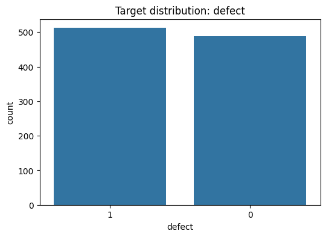

# Software Defects analysis


<!-- WARNING: THIS FILE WAS AUTOGENERATED! DO NOT EDIT! -->

Software Defects Multilingual Dataset with AST & Token Features (2025),
un conjunto de datos sintético diseñado para el estudio de predicción de
defectos en software y la análisis estático de código en múltiples
lenguajes de programación. Predecimoses entrenar modelos de machine
learning capaces de predecir si una función de código contiene defectos
o no, basándose en métricas estáticas (tokens, complejidad, estructuras
de control, etc.).

PLANNING: - INTRO - short dataset description. - EDA - shape, dtypes,
missing, class balance, sample rows, correlations. - PREPARING DATA -
drop useless columns, fix dtype issues, parse timestamps, coerce
numerics, encode label. - DATA SPLITTING - splitting training and
testing data. - RESULTS - early results. - PREPARING MODELS - prepare
hyperparameter, baseline models. - RESULTS WITH MULTIPLES MODELS-
metrics (precision/recall/f1), confusion matrix. - BALANCING - try
balancing and compare. - RESULTS (after balancing) - compare metrics. -
CONCLUSION - state best model, tradeoffs, next steps.

# EDA

## Importamos las librerías necesarias y cargamos el dataset

``` python
import pandas as pd
from pathlib import Path

base_dir = Path.cwd()
csv_file_path = base_dir.parent.parent / "data" / "software_defects" / "software_defects.csv"
df = pd.read_csv(csv_file_path, low_memory=False, index_col=0)
df.head(1)
```

<div>
<style scoped>
    .dataframe tbody tr th:only-of-type {
        vertical-align: middle;
    }
&#10;    .dataframe tbody tr th {
        vertical-align: top;
    }
&#10;    .dataframe thead th {
        text-align: right;
    }
</style>

<table class="dataframe" data-quarto-postprocess="true" data-border="1">
<thead>
<tr style="text-align: right;">
<th data-quarto-table-cell-role="th"></th>
<th data-quarto-table-cell-role="th">code</th>
<th data-quarto-table-cell-role="th">language</th>
<th data-quarto-table-cell-role="th">lines_of_code</th>
<th data-quarto-table-cell-role="th">cyclomatic_complexity</th>
<th data-quarto-table-cell-role="th">token_count</th>
<th data-quarto-table-cell-role="th">num_ifs</th>
<th data-quarto-table-cell-role="th">num_returns</th>
<th data-quarto-table-cell-role="th">num_func_calls</th>
<th data-quarto-table-cell-role="th">ast_nodes</th>
<th data-quarto-table-cell-role="th">defect</th>
</tr>
<tr>
<th data-quarto-table-cell-role="th">function_name</th>
<th data-quarto-table-cell-role="th"></th>
<th data-quarto-table-cell-role="th"></th>
<th data-quarto-table-cell-role="th"></th>
<th data-quarto-table-cell-role="th"></th>
<th data-quarto-table-cell-role="th"></th>
<th data-quarto-table-cell-role="th"></th>
<th data-quarto-table-cell-role="th"></th>
<th data-quarto-table-cell-role="th"></th>
<th data-quarto-table-cell-role="th"></th>
<th data-quarto-table-cell-role="th"></th>
</tr>
</thead>
<tbody>
<tr>
<td data-quarto-table-cell-role="th">go_func_0</td>
<td>func add(a int, b int) int { return a + b }</td>
<td>go</td>
<td>2</td>
<td>2</td>
<td>12</td>
<td>0</td>
<td>1</td>
<td>1</td>
<td>12</td>
<td>0</td>
</tr>
</tbody>
</table>

</div>

## Realizamos un analisis exploratorio sobre los datos

### Exploramos la forma general del dataset

``` python
# Realizamos un analysis exploratorio sobre los datos
print("Shape:", df.shape)
print("\nColumns and dtypes:")
print(df.dtypes)
print("\nNumeric summary (describe):")
display(df.describe().T)
```

    Shape: (1000, 10)

    Columns and dtypes:
    code                     object
    language                 object
    lines_of_code             int64
    cyclomatic_complexity     int64
    token_count               int64
    num_ifs                   int64
    num_returns               int64
    num_func_calls            int64
    ast_nodes                 int64
    defect                    int64
    dtype: object

    Numeric summary (describe):

<div>
<style scoped>
    .dataframe tbody tr th:only-of-type {
        vertical-align: middle;
    }
&#10;    .dataframe tbody tr th {
        vertical-align: top;
    }
&#10;    .dataframe thead th {
        text-align: right;
    }
</style>

<table class="dataframe" data-quarto-postprocess="true" data-border="1">
<thead>
<tr style="text-align: right;">
<th data-quarto-table-cell-role="th"></th>
<th data-quarto-table-cell-role="th">count</th>
<th data-quarto-table-cell-role="th">mean</th>
<th data-quarto-table-cell-role="th">std</th>
<th data-quarto-table-cell-role="th">min</th>
<th data-quarto-table-cell-role="th">25%</th>
<th data-quarto-table-cell-role="th">50%</th>
<th data-quarto-table-cell-role="th">75%</th>
<th data-quarto-table-cell-role="th">max</th>
</tr>
</thead>
<tbody>
<tr>
<td data-quarto-table-cell-role="th">lines_of_code</td>
<td>1000.0</td>
<td>3.431</td>
<td>1.708847</td>
<td>1.0</td>
<td>2.0</td>
<td>3.0</td>
<td>5.0</td>
<td>6.0</td>
</tr>
<tr>
<td data-quarto-table-cell-role="th">cyclomatic_complexity</td>
<td>1000.0</td>
<td>2.914</td>
<td>1.394471</td>
<td>1.0</td>
<td>2.0</td>
<td>3.0</td>
<td>4.0</td>
<td>5.0</td>
</tr>
<tr>
<td data-quarto-table-cell-role="th">token_count</td>
<td>1000.0</td>
<td>11.622</td>
<td>1.809528</td>
<td>9.0</td>
<td>11.0</td>
<td>12.0</td>
<td>12.0</td>
<td>18.0</td>
</tr>
<tr>
<td data-quarto-table-cell-role="th">num_ifs</td>
<td>1000.0</td>
<td>0.000</td>
<td>0.000000</td>
<td>0.0</td>
<td>0.0</td>
<td>0.0</td>
<td>0.0</td>
<td>0.0</td>
</tr>
<tr>
<td data-quarto-table-cell-role="th">num_returns</td>
<td>1000.0</td>
<td>0.856</td>
<td>0.351265</td>
<td>0.0</td>
<td>1.0</td>
<td>1.0</td>
<td>1.0</td>
<td>1.0</td>
</tr>
<tr>
<td data-quarto-table-cell-role="th">num_func_calls</td>
<td>1000.0</td>
<td>0.972</td>
<td>0.365170</td>
<td>0.0</td>
<td>1.0</td>
<td>1.0</td>
<td>1.0</td>
<td>2.0</td>
</tr>
<tr>
<td data-quarto-table-cell-role="th">ast_nodes</td>
<td>1000.0</td>
<td>11.622</td>
<td>1.809528</td>
<td>9.0</td>
<td>11.0</td>
<td>12.0</td>
<td>12.0</td>
<td>18.0</td>
</tr>
<tr>
<td data-quarto-table-cell-role="th">defect</td>
<td>1000.0</td>
<td>0.512</td>
<td>0.500106</td>
<td>0.0</td>
<td>0.0</td>
<td>1.0</td>
<td>1.0</td>
<td>1.0</td>
</tr>
</tbody>
</table>

</div>

### Verificamos valores nulos

``` python
# Resumen de valores nulos

missing_counts = df.isna().sum()
missing_percent = 100 * missing_counts / len(df)
missing_summary = pd.concat([missing_counts, missing_percent], axis=1)
missing_summary.columns = ["nulos", "porcentaje"]
print("\nNulos por columna (n y %):")
display(missing_summary.sort_values("nulos", ascending=False).head(20))
```


    Nulos por columna (n y %):

<div>
<style scoped>
    .dataframe tbody tr th:only-of-type {
        vertical-align: middle;
    }
&#10;    .dataframe tbody tr th {
        vertical-align: top;
    }
&#10;    .dataframe thead th {
        text-align: right;
    }
</style>

<table class="dataframe" data-quarto-postprocess="true" data-border="1">
<thead>
<tr style="text-align: right;">
<th data-quarto-table-cell-role="th"></th>
<th data-quarto-table-cell-role="th">nulos</th>
<th data-quarto-table-cell-role="th">porcentaje</th>
</tr>
</thead>
<tbody>
<tr>
<td data-quarto-table-cell-role="th">code</td>
<td>0</td>
<td>0.0</td>
</tr>
<tr>
<td data-quarto-table-cell-role="th">language</td>
<td>0</td>
<td>0.0</td>
</tr>
<tr>
<td data-quarto-table-cell-role="th">lines_of_code</td>
<td>0</td>
<td>0.0</td>
</tr>
<tr>
<td data-quarto-table-cell-role="th">cyclomatic_complexity</td>
<td>0</td>
<td>0.0</td>
</tr>
<tr>
<td data-quarto-table-cell-role="th">token_count</td>
<td>0</td>
<td>0.0</td>
</tr>
<tr>
<td data-quarto-table-cell-role="th">num_ifs</td>
<td>0</td>
<td>0.0</td>
</tr>
<tr>
<td data-quarto-table-cell-role="th">num_returns</td>
<td>0</td>
<td>0.0</td>
</tr>
<tr>
<td data-quarto-table-cell-role="th">num_func_calls</td>
<td>0</td>
<td>0.0</td>
</tr>
<tr>
<td data-quarto-table-cell-role="th">ast_nodes</td>
<td>0</td>
<td>0.0</td>
</tr>
<tr>
<td data-quarto-table-cell-role="th">defect</td>
<td>0</td>
<td>0.0</td>
</tr>
</tbody>
</table>

</div>

Revisamos su distribution

``` python
import matplotlib.pyplot as plt
import seaborn as sns

target_col = "defect"
figsize = (6, 4)

# Muestra los conteos y porcentajes para la variable binaria objetivo

vc = df[target_col].value_counts(dropna=False)
pct = (vc / len(df) * 100).round(2)
print("Counts:")
print(vc)
print("\nPercent:")
print(pct)

plt.figure(figsize=figsize)
sns.barplot(x=vc.index.astype(str), y=vc.values)
plt.title(f"Target distribution: {target_col}")
plt.ylabel("count")
plt.xlabel(target_col)
plt.show()
```

    Counts:
    defect
    1    512
    0    488
    Name: count, dtype: int64

    Percent:
    defect
    1    51.2
    0    48.8
    Name: count, dtype: float64



# PREPARING DATA

``` python
# Hacemos una copia del DataFrame original para no modificar el raw
df_clean = df.copy()

# Eliminamos filas con valores nulos
df_clean = df_clean.dropna()

# Verificamos que no queden valores únicos
df_clean.nunique().sort_values()

# Quitamos espacios en los nombres de las columnas
df_clean.columns = df_clean.columns.str.strip()

# Analizamos el tipo de columnas en busca de columnas que no sean numéricas o apropiadas para el análisis
df_clean.keys()
```

    Index(['code', 'language', 'lines_of_code', 'cyclomatic_complexity',
           'token_count', 'num_ifs', 'num_returns', 'num_func_calls', 'ast_nodes',
           'defect'],
          dtype='object')

``` python
# Revisar columnas constantes
constant_cols = [c for c in df_clean.columns if df_clean[c].nunique() <= 1]
print("Constant columns:", constant_cols)
```

    Constant columns: ['num_ifs']

``` python
# Verificamos columna seleccionada como constante, si solo existe un valor único, no aporta información.
df_clean["num_ifs"].unique()
```

    array([0])

``` python
# Quitamos columnas constantes
df_clean = df_clean.drop(columns=constant_cols)
```

``` python
# Revisar tipos y columnas mixtas
df_clean.dtypes.value_counts()
```

    int64     7
    object    2
    Name: count, dtype: int64

``` python
# Para identificar columnas no numéricas usamos:
df_clean.select_dtypes(include=['object']).columns.tolist()
```

    ['code', 'language']

revisamos columnas para identificar posibles errores

``` python
df_clean["code"].head(1)
```

    function_name
    go_func_0    func add(a int, b int) int { return a + b }
    Name: code, dtype: object

``` python
# La columna "code" contiene información no numérica, sin embargo, puede aportar información relevante para el modelo,
# por lo que la conservaremos y la procesaremos adecuadamente al momento de preparar los datos para el modelo.
# si quisiéramos eliminarla, usaríamos:
# df_clean = df_clean.drop(columns=["code"])
```

``` python
df_clean["language"].head(10)
```

    function_name
    go_func_0            go
    python_func_1    python
    c_func_2              c
    cpp_func_3          cpp
    cpp_func_4          cpp
    c_func_5              c
    go_func_6            go
    rust_func_7        rust
    java_func_8        java
    rust_func_9        rust
    Name: language, dtype: object

``` python
df_clean["language"].unique()
```

    array(['go', 'python', 'c', 'cpp', 'rust', 'java', 'javascript'],
          dtype=object)

``` python
# La categoría 'language' es categórica nominal, por lo que aplicamos one-hot encoding, ya que no existe un orden entre las categorías.
# ej. Si convertimos a números enteros, el modelo podría interpretar que 2 > 1 > 0, lo cual no es correcto.
# Generamos variables dummy para la columna 'language'
languages_df = pd.get_dummies(df_clean["language"])
# Concatenamos las nuevas columnas al DataFrame original y eliminamos la columna 'language'
df_clean = pd.concat([df_clean, languages_df], axis=1)
df_clean = df_clean.drop(columns=["language"])
```

``` python
# Reordenamos las columnas para que la variable objetivo quede al final, lo cual es una buena práctica
col = df_clean.pop("defect")
df_clean["defect"] = col
```

``` python
# Tenemos valores boolean que para efectos prácticos pueden ser tratados como enteros 0/1 por el proceso de entrenamiento.
# Sin embargo es mejor convertirlos explícitamente a int para evitar problemas de tipo de datos en el modelo.
# Seleccionamos todas las columnas bool
bool_cols = df_clean.select_dtypes(include="bool").columns

# Convertimos a int (0/1)
df_clean[bool_cols] = df_clean[bool_cols].astype(int)
```

``` python
# nuestro dataset limpio
df_clean.info()
```

    <class 'pandas.core.frame.DataFrame'>
    Index: 1000 entries, go_func_0 to c_func_999
    Data columns (total 15 columns):
     #   Column                 Non-Null Count  Dtype 
    ---  ------                 --------------  ----- 
     0   code                   1000 non-null   object
     1   lines_of_code          1000 non-null   int64 
     2   cyclomatic_complexity  1000 non-null   int64 
     3   token_count            1000 non-null   int64 
     4   num_returns            1000 non-null   int64 
     5   num_func_calls         1000 non-null   int64 
     6   ast_nodes              1000 non-null   int64 
     7   c                      1000 non-null   int64 
     8   cpp                    1000 non-null   int64 
     9   go                     1000 non-null   int64 
     10  java                   1000 non-null   int64 
     11  javascript             1000 non-null   int64 
     12  python                 1000 non-null   int64 
     13  rust                   1000 non-null   int64 
     14  defect                 1000 non-null   int64 
    dtypes: int64(14), object(1)
    memory usage: 125.0+ KB

``` python
df_clean.head(5)
```

<div>
<style scoped>
    .dataframe tbody tr th:only-of-type {
        vertical-align: middle;
    }
&#10;    .dataframe tbody tr th {
        vertical-align: top;
    }
&#10;    .dataframe thead th {
        text-align: right;
    }
</style>

<table class="dataframe" data-quarto-postprocess="true" data-border="1">
<thead>
<tr style="text-align: right;">
<th data-quarto-table-cell-role="th"></th>
<th data-quarto-table-cell-role="th">code</th>
<th data-quarto-table-cell-role="th">lines_of_code</th>
<th data-quarto-table-cell-role="th">cyclomatic_complexity</th>
<th data-quarto-table-cell-role="th">token_count</th>
<th data-quarto-table-cell-role="th">num_returns</th>
<th data-quarto-table-cell-role="th">num_func_calls</th>
<th data-quarto-table-cell-role="th">ast_nodes</th>
<th data-quarto-table-cell-role="th">c</th>
<th data-quarto-table-cell-role="th">cpp</th>
<th data-quarto-table-cell-role="th">go</th>
<th data-quarto-table-cell-role="th">java</th>
<th data-quarto-table-cell-role="th">javascript</th>
<th data-quarto-table-cell-role="th">python</th>
<th data-quarto-table-cell-role="th">rust</th>
<th data-quarto-table-cell-role="th">defect</th>
</tr>
<tr>
<th data-quarto-table-cell-role="th">function_name</th>
<th data-quarto-table-cell-role="th"></th>
<th data-quarto-table-cell-role="th"></th>
<th data-quarto-table-cell-role="th"></th>
<th data-quarto-table-cell-role="th"></th>
<th data-quarto-table-cell-role="th"></th>
<th data-quarto-table-cell-role="th"></th>
<th data-quarto-table-cell-role="th"></th>
<th data-quarto-table-cell-role="th"></th>
<th data-quarto-table-cell-role="th"></th>
<th data-quarto-table-cell-role="th"></th>
<th data-quarto-table-cell-role="th"></th>
<th data-quarto-table-cell-role="th"></th>
<th data-quarto-table-cell-role="th"></th>
<th data-quarto-table-cell-role="th"></th>
<th data-quarto-table-cell-role="th"></th>
</tr>
</thead>
<tbody>
<tr>
<td data-quarto-table-cell-role="th">go_func_0</td>
<td>func add(a int, b int) int { return a + b }</td>
<td>2</td>
<td>2</td>
<td>12</td>
<td>1</td>
<td>1</td>
<td>12</td>
<td>0</td>
<td>0</td>
<td>1</td>
<td>0</td>
<td>0</td>
<td>0</td>
<td>0</td>
<td>0</td>
</tr>
<tr>
<td data-quarto-table-cell-role="th">python_func_1</td>
<td>def add(a, b): return a + b</td>
<td>2</td>
<td>5</td>
<td>12</td>
<td>1</td>
<td>0</td>
<td>12</td>
<td>0</td>
<td>0</td>
<td>0</td>
<td>0</td>
<td>0</td>
<td>1</td>
<td>0</td>
<td>0</td>
</tr>
<tr>
<td data-quarto-table-cell-role="th">c_func_2</td>
<td>int divide(int a, int b) { return a / b; }</td>
<td>3</td>
<td>4</td>
<td>11</td>
<td>1</td>
<td>1</td>
<td>11</td>
<td>1</td>
<td>0</td>
<td>0</td>
<td>0</td>
<td>0</td>
<td>0</td>
<td>0</td>
<td>1</td>
</tr>
<tr>
<td data-quarto-table-cell-role="th">cpp_func_3</td>
<td>int add(int a, int b) { return a + b; }</td>
<td>6</td>
<td>5</td>
<td>11</td>
<td>1</td>
<td>1</td>
<td>11</td>
<td>0</td>
<td>1</td>
<td>0</td>
<td>0</td>
<td>0</td>
<td>0</td>
<td>0</td>
<td>0</td>
</tr>
<tr>
<td data-quarto-table-cell-role="th">cpp_func_4</td>
<td>int add(int a, int b) { return a + b; }</td>
<td>2</td>
<td>3</td>
<td>11</td>
<td>1</td>
<td>1</td>
<td>11</td>
<td>0</td>
<td>1</td>
<td>0</td>
<td>0</td>
<td>0</td>
<td>0</td>
<td>0</td>
<td>0</td>
</tr>
</tbody>
</table>

</div>

``` python
df_clean = df_clean.reset_index(drop=True)
```

``` python
df_clean.head(1)
```

<div>
<style scoped>
    .dataframe tbody tr th:only-of-type {
        vertical-align: middle;
    }
&#10;    .dataframe tbody tr th {
        vertical-align: top;
    }
&#10;    .dataframe thead th {
        text-align: right;
    }
</style>

<table class="dataframe" data-quarto-postprocess="true" data-border="1">
<thead>
<tr style="text-align: right;">
<th data-quarto-table-cell-role="th"></th>
<th data-quarto-table-cell-role="th">code</th>
<th data-quarto-table-cell-role="th">lines_of_code</th>
<th data-quarto-table-cell-role="th">cyclomatic_complexity</th>
<th data-quarto-table-cell-role="th">token_count</th>
<th data-quarto-table-cell-role="th">num_returns</th>
<th data-quarto-table-cell-role="th">num_func_calls</th>
<th data-quarto-table-cell-role="th">ast_nodes</th>
<th data-quarto-table-cell-role="th">c</th>
<th data-quarto-table-cell-role="th">cpp</th>
<th data-quarto-table-cell-role="th">go</th>
<th data-quarto-table-cell-role="th">java</th>
<th data-quarto-table-cell-role="th">javascript</th>
<th data-quarto-table-cell-role="th">python</th>
<th data-quarto-table-cell-role="th">rust</th>
<th data-quarto-table-cell-role="th">defect</th>
</tr>
</thead>
<tbody>
<tr>
<td data-quarto-table-cell-role="th">0</td>
<td>func add(a int, b int) int { return a + b }</td>
<td>2</td>
<td>2</td>
<td>12</td>
<td>1</td>
<td>1</td>
<td>12</td>
<td>0</td>
<td>0</td>
<td>1</td>
<td>0</td>
<td>0</td>
<td>0</td>
<td>0</td>
<td>0</td>
</tr>
</tbody>
</table>

</div>

# DATA SPLITTINGG

Separamos nuestro dataset en datos que serán usados para entrenamiento y
para testing

Se consideran dos formas para proceder, si hemos eliminado la columna
‘code’ podemos simplemente separar los datos:

``` python
# from sklearn.model_selection import train_test_split

# X = df_clean.iloc[:,:-1].values
# y = df_clean['defect'].values

# X_train, X_test, y_train, y_test = train_test_split(X, y, test_size=.30, random_state=15, stratify=y)
```

Si hemos mantenido la columna ‘code’ debemos vectorizar sus datos:

``` python
from sklearn.feature_extraction.text import TfidfVectorizer
from scipy.sparse import hstack
from scipy.sparse import csr_matrix
from sklearn.model_selection import train_test_split

df_reset = df_clean.reset_index()

# Features numéricos + one-hot languages
X_numeric = df_clean.drop(columns=["code", "defect"]).values

# Target
y = df_clean["defect"].values

# Vectorizamos la columna 'code' usando TF-IDF
vectorizer = TfidfVectorizer(analyzer='word', ngram_range=(1,3), max_features=50)
X_code = vectorizer.fit_transform(df_clean["code"])

# Combinamos las features numéricas con las features de texto vectorizadas
X_numeric_sparse = csr_matrix(X_numeric)
X_combined = hstack([X_numeric_sparse, X_code])

# Separamos en conjunto de entrenamiento y prueba
X_train, X_test, y_train, y_test = train_test_split(X_combined, y, test_size=0.3, random_state=15, stratify=y)
```

# RESULTS

Con todos los elementos necesarios, podemos realizar el entrenamiento y
predicción sobre el conjunto de datos.

``` python
# Realizamos el entrenamiento con un modelo de clasificación simple

from sklearn.neighbors import KNeighborsClassifier

clf = KNeighborsClassifier()

clf.fit(X_train, y_train)
```

<style>#sk-container-id-1 {
  /* Definition of color scheme common for light and dark mode */
  --sklearn-color-text: #000;
  --sklearn-color-text-muted: #666;
  --sklearn-color-line: gray;
  /* Definition of color scheme for unfitted estimators */
  --sklearn-color-unfitted-level-0: #fff5e6;
  --sklearn-color-unfitted-level-1: #f6e4d2;
  --sklearn-color-unfitted-level-2: #ffe0b3;
  --sklearn-color-unfitted-level-3: chocolate;
  /* Definition of color scheme for fitted estimators */
  --sklearn-color-fitted-level-0: #f0f8ff;
  --sklearn-color-fitted-level-1: #d4ebff;
  --sklearn-color-fitted-level-2: #b3dbfd;
  --sklearn-color-fitted-level-3: cornflowerblue;
&#10;  /* Specific color for light theme */
  --sklearn-color-text-on-default-background: var(--sg-text-color, var(--theme-code-foreground, var(--jp-content-font-color1, black)));
  --sklearn-color-background: var(--sg-background-color, var(--theme-background, var(--jp-layout-color0, white)));
  --sklearn-color-border-box: var(--sg-text-color, var(--theme-code-foreground, var(--jp-content-font-color1, black)));
  --sklearn-color-icon: #696969;
&#10;  @media (prefers-color-scheme: dark) {
    /* Redefinition of color scheme for dark theme */
    --sklearn-color-text-on-default-background: var(--sg-text-color, var(--theme-code-foreground, var(--jp-content-font-color1, white)));
    --sklearn-color-background: var(--sg-background-color, var(--theme-background, var(--jp-layout-color0, #111)));
    --sklearn-color-border-box: var(--sg-text-color, var(--theme-code-foreground, var(--jp-content-font-color1, white)));
    --sklearn-color-icon: #878787;
  }
}
&#10;#sk-container-id-1 {
  color: var(--sklearn-color-text);
}
&#10;#sk-container-id-1 pre {
  padding: 0;
}
&#10;#sk-container-id-1 input.sk-hidden--visually {
  border: 0;
  clip: rect(1px 1px 1px 1px);
  clip: rect(1px, 1px, 1px, 1px);
  height: 1px;
  margin: -1px;
  overflow: hidden;
  padding: 0;
  position: absolute;
  width: 1px;
}
&#10;#sk-container-id-1 div.sk-dashed-wrapped {
  border: 1px dashed var(--sklearn-color-line);
  margin: 0 0.4em 0.5em 0.4em;
  box-sizing: border-box;
  padding-bottom: 0.4em;
  background-color: var(--sklearn-color-background);
}
&#10;#sk-container-id-1 div.sk-container {
  /* jupyter's `normalize.less` sets `[hidden] { display: none; }`
     but bootstrap.min.css set `[hidden] { display: none !important; }`
     so we also need the `!important` here to be able to override the
     default hidden behavior on the sphinx rendered scikit-learn.org.
     See: https://github.com/scikit-learn/scikit-learn/issues/21755 */
  display: inline-block !important;
  position: relative;
}
&#10;#sk-container-id-1 div.sk-text-repr-fallback {
  display: none;
}
&#10;div.sk-parallel-item,
div.sk-serial,
div.sk-item {
  /* draw centered vertical line to link estimators */
  background-image: linear-gradient(var(--sklearn-color-text-on-default-background), var(--sklearn-color-text-on-default-background));
  background-size: 2px 100%;
  background-repeat: no-repeat;
  background-position: center center;
}
&#10;/* Parallel-specific style estimator block */
&#10;#sk-container-id-1 div.sk-parallel-item::after {
  content: "";
  width: 100%;
  border-bottom: 2px solid var(--sklearn-color-text-on-default-background);
  flex-grow: 1;
}
&#10;#sk-container-id-1 div.sk-parallel {
  display: flex;
  align-items: stretch;
  justify-content: center;
  background-color: var(--sklearn-color-background);
  position: relative;
}
&#10;#sk-container-id-1 div.sk-parallel-item {
  display: flex;
  flex-direction: column;
}
&#10;#sk-container-id-1 div.sk-parallel-item:first-child::after {
  align-self: flex-end;
  width: 50%;
}
&#10;#sk-container-id-1 div.sk-parallel-item:last-child::after {
  align-self: flex-start;
  width: 50%;
}
&#10;#sk-container-id-1 div.sk-parallel-item:only-child::after {
  width: 0;
}
&#10;/* Serial-specific style estimator block */
&#10;#sk-container-id-1 div.sk-serial {
  display: flex;
  flex-direction: column;
  align-items: center;
  background-color: var(--sklearn-color-background);
  padding-right: 1em;
  padding-left: 1em;
}
&#10;
/* Toggleable style: style used for estimator/Pipeline/ColumnTransformer box that is
clickable and can be expanded/collapsed.
- Pipeline and ColumnTransformer use this feature and define the default style
- Estimators will overwrite some part of the style using the `sk-estimator` class
*/
&#10;/* Pipeline and ColumnTransformer style (default) */
&#10;#sk-container-id-1 div.sk-toggleable {
  /* Default theme specific background. It is overwritten whether we have a
  specific estimator or a Pipeline/ColumnTransformer */
  background-color: var(--sklearn-color-background);
}
&#10;/* Toggleable label */
#sk-container-id-1 label.sk-toggleable__label {
  cursor: pointer;
  display: flex;
  width: 100%;
  margin-bottom: 0;
  padding: 0.5em;
  box-sizing: border-box;
  text-align: center;
  align-items: start;
  justify-content: space-between;
  gap: 0.5em;
}
&#10;#sk-container-id-1 label.sk-toggleable__label .caption {
  font-size: 0.6rem;
  font-weight: lighter;
  color: var(--sklearn-color-text-muted);
}
&#10;#sk-container-id-1 label.sk-toggleable__label-arrow:before {
  /* Arrow on the left of the label */
  content: "▸";
  float: left;
  margin-right: 0.25em;
  color: var(--sklearn-color-icon);
}
&#10;#sk-container-id-1 label.sk-toggleable__label-arrow:hover:before {
  color: var(--sklearn-color-text);
}
&#10;/* Toggleable content - dropdown */
&#10;#sk-container-id-1 div.sk-toggleable__content {
  display: none;
  text-align: left;
  /* unfitted */
  background-color: var(--sklearn-color-unfitted-level-0);
}
&#10;#sk-container-id-1 div.sk-toggleable__content.fitted {
  /* fitted */
  background-color: var(--sklearn-color-fitted-level-0);
}
&#10;#sk-container-id-1 div.sk-toggleable__content pre {
  margin: 0.2em;
  border-radius: 0.25em;
  color: var(--sklearn-color-text);
  /* unfitted */
  background-color: var(--sklearn-color-unfitted-level-0);
}
&#10;#sk-container-id-1 div.sk-toggleable__content.fitted pre {
  /* unfitted */
  background-color: var(--sklearn-color-fitted-level-0);
}
&#10;#sk-container-id-1 input.sk-toggleable__control:checked~div.sk-toggleable__content {
  /* Expand drop-down */
  display: block;
  width: 100%;
  overflow: visible;
}
&#10;#sk-container-id-1 input.sk-toggleable__control:checked~label.sk-toggleable__label-arrow:before {
  content: "▾";
}
&#10;/* Pipeline/ColumnTransformer-specific style */
&#10;#sk-container-id-1 div.sk-label input.sk-toggleable__control:checked~label.sk-toggleable__label {
  color: var(--sklearn-color-text);
  background-color: var(--sklearn-color-unfitted-level-2);
}
&#10;#sk-container-id-1 div.sk-label.fitted input.sk-toggleable__control:checked~label.sk-toggleable__label {
  background-color: var(--sklearn-color-fitted-level-2);
}
&#10;/* Estimator-specific style */
&#10;/* Colorize estimator box */
#sk-container-id-1 div.sk-estimator input.sk-toggleable__control:checked~label.sk-toggleable__label {
  /* unfitted */
  background-color: var(--sklearn-color-unfitted-level-2);
}
&#10;#sk-container-id-1 div.sk-estimator.fitted input.sk-toggleable__control:checked~label.sk-toggleable__label {
  /* fitted */
  background-color: var(--sklearn-color-fitted-level-2);
}
&#10;#sk-container-id-1 div.sk-label label.sk-toggleable__label,
#sk-container-id-1 div.sk-label label {
  /* The background is the default theme color */
  color: var(--sklearn-color-text-on-default-background);
}
&#10;/* On hover, darken the color of the background */
#sk-container-id-1 div.sk-label:hover label.sk-toggleable__label {
  color: var(--sklearn-color-text);
  background-color: var(--sklearn-color-unfitted-level-2);
}
&#10;/* Label box, darken color on hover, fitted */
#sk-container-id-1 div.sk-label.fitted:hover label.sk-toggleable__label.fitted {
  color: var(--sklearn-color-text);
  background-color: var(--sklearn-color-fitted-level-2);
}
&#10;/* Estimator label */
&#10;#sk-container-id-1 div.sk-label label {
  font-family: monospace;
  font-weight: bold;
  display: inline-block;
  line-height: 1.2em;
}
&#10;#sk-container-id-1 div.sk-label-container {
  text-align: center;
}
&#10;/* Estimator-specific */
#sk-container-id-1 div.sk-estimator {
  font-family: monospace;
  border: 1px dotted var(--sklearn-color-border-box);
  border-radius: 0.25em;
  box-sizing: border-box;
  margin-bottom: 0.5em;
  /* unfitted */
  background-color: var(--sklearn-color-unfitted-level-0);
}
&#10;#sk-container-id-1 div.sk-estimator.fitted {
  /* fitted */
  background-color: var(--sklearn-color-fitted-level-0);
}
&#10;/* on hover */
#sk-container-id-1 div.sk-estimator:hover {
  /* unfitted */
  background-color: var(--sklearn-color-unfitted-level-2);
}
&#10;#sk-container-id-1 div.sk-estimator.fitted:hover {
  /* fitted */
  background-color: var(--sklearn-color-fitted-level-2);
}
&#10;/* Specification for estimator info (e.g. "i" and "?") */
&#10;/* Common style for "i" and "?" */
&#10;.sk-estimator-doc-link,
a:link.sk-estimator-doc-link,
a:visited.sk-estimator-doc-link {
  float: right;
  font-size: smaller;
  line-height: 1em;
  font-family: monospace;
  background-color: var(--sklearn-color-background);
  border-radius: 1em;
  height: 1em;
  width: 1em;
  text-decoration: none !important;
  margin-left: 0.5em;
  text-align: center;
  /* unfitted */
  border: var(--sklearn-color-unfitted-level-1) 1pt solid;
  color: var(--sklearn-color-unfitted-level-1);
}
&#10;.sk-estimator-doc-link.fitted,
a:link.sk-estimator-doc-link.fitted,
a:visited.sk-estimator-doc-link.fitted {
  /* fitted */
  border: var(--sklearn-color-fitted-level-1) 1pt solid;
  color: var(--sklearn-color-fitted-level-1);
}
&#10;/* On hover */
div.sk-estimator:hover .sk-estimator-doc-link:hover,
.sk-estimator-doc-link:hover,
div.sk-label-container:hover .sk-estimator-doc-link:hover,
.sk-estimator-doc-link:hover {
  /* unfitted */
  background-color: var(--sklearn-color-unfitted-level-3);
  color: var(--sklearn-color-background);
  text-decoration: none;
}
&#10;div.sk-estimator.fitted:hover .sk-estimator-doc-link.fitted:hover,
.sk-estimator-doc-link.fitted:hover,
div.sk-label-container:hover .sk-estimator-doc-link.fitted:hover,
.sk-estimator-doc-link.fitted:hover {
  /* fitted */
  background-color: var(--sklearn-color-fitted-level-3);
  color: var(--sklearn-color-background);
  text-decoration: none;
}
&#10;/* Span, style for the box shown on hovering the info icon */
.sk-estimator-doc-link span {
  display: none;
  z-index: 9999;
  position: relative;
  font-weight: normal;
  right: .2ex;
  padding: .5ex;
  margin: .5ex;
  width: min-content;
  min-width: 20ex;
  max-width: 50ex;
  color: var(--sklearn-color-text);
  box-shadow: 2pt 2pt 4pt #999;
  /* unfitted */
  background: var(--sklearn-color-unfitted-level-0);
  border: .5pt solid var(--sklearn-color-unfitted-level-3);
}
&#10;.sk-estimator-doc-link.fitted span {
  /* fitted */
  background: var(--sklearn-color-fitted-level-0);
  border: var(--sklearn-color-fitted-level-3);
}
&#10;.sk-estimator-doc-link:hover span {
  display: block;
}
&#10;/* "?"-specific style due to the `<a>` HTML tag */
&#10;#sk-container-id-1 a.estimator_doc_link {
  float: right;
  font-size: 1rem;
  line-height: 1em;
  font-family: monospace;
  background-color: var(--sklearn-color-background);
  border-radius: 1rem;
  height: 1rem;
  width: 1rem;
  text-decoration: none;
  /* unfitted */
  color: var(--sklearn-color-unfitted-level-1);
  border: var(--sklearn-color-unfitted-level-1) 1pt solid;
}
&#10;#sk-container-id-1 a.estimator_doc_link.fitted {
  /* fitted */
  border: var(--sklearn-color-fitted-level-1) 1pt solid;
  color: var(--sklearn-color-fitted-level-1);
}
&#10;/* On hover */
#sk-container-id-1 a.estimator_doc_link:hover {
  /* unfitted */
  background-color: var(--sklearn-color-unfitted-level-3);
  color: var(--sklearn-color-background);
  text-decoration: none;
}
&#10;#sk-container-id-1 a.estimator_doc_link.fitted:hover {
  /* fitted */
  background-color: var(--sklearn-color-fitted-level-3);
}
&#10;.estimator-table summary {
    padding: .5rem;
    font-family: monospace;
    cursor: pointer;
}
&#10;.estimator-table details[open] {
    padding-left: 0.1rem;
    padding-right: 0.1rem;
    padding-bottom: 0.3rem;
}
&#10;.estimator-table .parameters-table {
    margin-left: auto !important;
    margin-right: auto !important;
}
&#10;.estimator-table .parameters-table tr:nth-child(odd) {
    background-color: #fff;
}
&#10;.estimator-table .parameters-table tr:nth-child(even) {
    background-color: #f6f6f6;
}
&#10;.estimator-table .parameters-table tr:hover {
    background-color: #e0e0e0;
}
&#10;.estimator-table table td {
    border: 1px solid rgba(106, 105, 104, 0.232);
}
&#10;.user-set td {
    color:rgb(255, 94, 0);
    text-align: left;
}
&#10;.user-set td.value pre {
    color:rgb(255, 94, 0) !important;
    background-color: transparent !important;
}
&#10;.default td {
    color: black;
    text-align: left;
}
&#10;.user-set td i,
.default td i {
    color: black;
}
&#10;.copy-paste-icon {
    background-image: url(data:image/svg+xml;base64,PHN2ZyB4bWxucz0iaHR0cDovL3d3dy53My5vcmcvMjAwMC9zdmciIHZpZXdCb3g9IjAgMCA0NDggNTEyIj48IS0tIUZvbnQgQXdlc29tZSBGcmVlIDYuNy4yIGJ5IEBmb250YXdlc29tZSAtIGh0dHBzOi8vZm9udGF3ZXNvbWUuY29tIExpY2Vuc2UgLSBodHRwczovL2ZvbnRhd2Vzb21lLmNvbS9saWNlbnNlL2ZyZWUgQ29weXJpZ2h0IDIwMjUgRm9udGljb25zLCBJbmMuLS0+PHBhdGggZD0iTTIwOCAwTDMzMi4xIDBjMTIuNyAwIDI0LjkgNS4xIDMzLjkgMTQuMWw2Ny45IDY3LjljOSA5IDE0LjEgMjEuMiAxNC4xIDMzLjlMNDQ4IDMzNmMwIDI2LjUtMjEuNSA0OC00OCA0OGwtMTkyIDBjLTI2LjUgMC00OC0yMS41LTQ4LTQ4bDAtMjg4YzAtMjYuNSAyMS41LTQ4IDQ4LTQ4ek00OCAxMjhsODAgMCAwIDY0LTY0IDAgMCAyNTYgMTkyIDAgMC0zMiA2NCAwIDAgNDhjMCAyNi41LTIxLjUgNDgtNDggNDhMNDggNTEyYy0yNi41IDAtNDgtMjEuNS00OC00OEwwIDE3NmMwLTI2LjUgMjEuNS00OCA0OC00OHoiLz48L3N2Zz4=);
    background-repeat: no-repeat;
    background-size: 14px 14px;
    background-position: 0;
    display: inline-block;
    width: 14px;
    height: 14px;
    cursor: pointer;
}
</style><body><div id="sk-container-id-1" class="sk-top-container"><div class="sk-text-repr-fallback"><pre>KNeighborsClassifier()</pre><b>In a Jupyter environment, please rerun this cell to show the HTML representation or trust the notebook. <br />On GitHub, the HTML representation is unable to render, please try loading this page with nbviewer.org.</b></div><div class="sk-container" hidden><div class="sk-item"><div class="sk-estimator fitted sk-toggleable"><input class="sk-toggleable__control sk-hidden--visually" id="sk-estimator-id-1" type="checkbox" checked><label for="sk-estimator-id-1" class="sk-toggleable__label fitted sk-toggleable__label-arrow"><div><div>KNeighborsClassifier</div></div><div><a class="sk-estimator-doc-link fitted" rel="noreferrer" target="_blank" href="https://scikit-learn.org/1.7/modules/generated/sklearn.neighbors.KNeighborsClassifier.html">?<span>Documentation for KNeighborsClassifier</span></a><span class="sk-estimator-doc-link fitted">i<span>Fitted</span></span></div></label><div class="sk-toggleable__content fitted" data-param-prefix="">
        <div class="estimator-table">
            <details>
                <summary>Parameters</summary>
                &#10;

<table class="parameters-table" data-quarto-postprocess="true">
<tbody>
<tr class="default">
<td><em></em></td>
<td class="param">n_neighbors </td>
<td class="value">5</td>
</tr>
<tr class="default">
<td><em></em></td>
<td class="param">weights </td>
<td class="value">'uniform'</td>
</tr>
<tr class="default">
<td><em></em></td>
<td class="param">algorithm </td>
<td class="value">'auto'</td>
</tr>
<tr class="default">
<td><em></em></td>
<td class="param">leaf_size </td>
<td class="value">30</td>
</tr>
<tr class="default">
<td><em></em></td>
<td class="param">p </td>
<td class="value">2</td>
</tr>
<tr class="default">
<td><em></em></td>
<td class="param">metric </td>
<td class="value">'minkowski'</td>
</tr>
<tr class="default">
<td><em></em></td>
<td class="param">metric_params </td>
<td class="value">None</td>
</tr>
<tr class="default">
<td><em></em></td>
<td class="param">n_jobs </td>
<td class="value">None</td>
</tr>
</tbody>
</table>

            </details>
        </div>
    </div></div></div></div></div><script>function copyToClipboard(text, element) {
    // Get the parameter prefix from the closest toggleable content
    const toggleableContent = element.closest('.sk-toggleable__content');
    const paramPrefix = toggleableContent ? toggleableContent.dataset.paramPrefix : '';
    const fullParamName = paramPrefix ? `${paramPrefix}${text}` : text;
&#10;    const originalStyle = element.style;
    const computedStyle = window.getComputedStyle(element);
    const originalWidth = computedStyle.width;
    const originalHTML = element.innerHTML.replace('Copied!', '');
&#10;    navigator.clipboard.writeText(fullParamName)
        .then(() => {
            element.style.width = originalWidth;
            element.style.color = 'green';
            element.innerHTML = "Copied!";
&#10;            setTimeout(() => {
                element.innerHTML = originalHTML;
                element.style = originalStyle;
            }, 2000);
        })
        .catch(err => {
            console.error('Failed to copy:', err);
            element.style.color = 'red';
            element.innerHTML = "Failed!";
            setTimeout(() => {
                element.innerHTML = originalHTML;
                element.style = originalStyle;
            }, 2000);
        });
    return false;
}
&#10;document.querySelectorAll('.fa-regular.fa-copy').forEach(function(element) {
    const toggleableContent = element.closest('.sk-toggleable__content');
    const paramPrefix = toggleableContent ? toggleableContent.dataset.paramPrefix : '';
    const paramName = element.parentElement.nextElementSibling.textContent.trim();
    const fullParamName = paramPrefix ? `${paramPrefix}${paramName}` : paramName;
&#10;    element.setAttribute('title', fullParamName);
});
</script></body>

``` python
# Realizamos la predicción sobre el conjunto de test
y_pred = clf.predict(X_test)
```

``` python
# Verificamos los resultados obtenidos
from sklearn.metrics import classification_report

print(classification_report(y_test, y_pred))
```

                  precision    recall  f1-score   support

               0       0.79      0.84      0.81       146
               1       0.84      0.79      0.81       154

        accuracy                           0.81       300
       macro avg       0.81      0.81      0.81       300
    weighted avg       0.81      0.81      0.81       300

# PREPARING MULTIPLE MODELS

Con el objetivo de encontrar el modelo que mejor se ajusta a nuestro
problema configuraremos distintos modelos ajustando distintos
hyperparametros.

``` python
from sklearn.dummy import DummyClassifier
from sklearn.tree import DecisionTreeClassifier
from sklearn.ensemble import RandomForestClassifier
from sklearn.svm import SVC
from sklearn.naive_bayes import GaussianNB
from sklearn.neighbors import KNeighborsClassifier
from sklearn.model_selection import GridSearchCV
from sklearn.metrics import classification_report
```

``` python
### DUMMY (baseline)

param_grid_dm = {
    'strategy': ['most_frequent', 'stratified', 'uniform']
}

scoring = 'f1'

clf_dm = GridSearchCV(DummyClassifier(), param_grid=param_grid_dm, scoring=scoring, cv=10)
```

``` python
### DECISION TREE

param_grid_dt = {
    'criterion': ['gini', 'entropy'],
    'max_depth': [3],
    'min_samples_split': [10],
    'min_samples_leaf': [10],
    'max_features': ['sqrt'],
    'class_weight': ['balanced'],
}

scoring = 'f1'

clf_dt = GridSearchCV(DecisionTreeClassifier(), param_grid=param_grid_dt, scoring=scoring, cv=10)
```

``` python
### RANDOM FOREST

param_grid_rf = {
    'n_estimators': [50],
    'max_depth': [3],
    'min_samples_split': [5],
    'min_samples_leaf': [10],
    'max_features': ['sqrt'],
    'criterion': ['gini', 'entropy'],
    'class_weight': ['balanced'],
}

clf_rf = GridSearchCV(RandomForestClassifier(), param_grid=param_grid_rf, scoring='f1', cv=10)
```

``` python
### SUPPORT VECTOR CLASSIFIER

param_grid_svc = {
    'C': [1],          
    'kernel': ['rbf'],
}

clf_svc = GridSearchCV(SVC(), param_grid=param_grid_svc, scoring='f1', cv=10)
```

``` python
### K-NEIGHBORS

param_grid_knn = {
    'n_neighbors': [3, 5, 7],
    'weights': ['uniform', 'distance'],
    'metric': ['euclidean', 'manhattan']
}

clf_knn = GridSearchCV(KNeighborsClassifier(), param_grid=param_grid_knn, scoring='f1', cv=10)
```

Una vez tengamos los modelos creados los agruparemos para luego iterar
sobre ellos y comparar sus resultados

``` python
# Agrupamos los clasificadores en un diccionario para luego iterar sobre ellos
classifiers = {
    "Base dummy": clf_dm,
    "Decision Tree": clf_dt, 
    "Random Forest": clf_rf, 
    "Support Vector Classifier": clf_svc, 
    "K-neighbors": clf_knn
}
```

``` python
# Función para entrenar y evaluar múltiples modelos
def train_with_multiples_models(classifiers: dict, X_train, y_train, X_test, y_test):
    for name, clf in classifiers.items():
        print(':::::::::::::::::::::::::::::::::::::::::')
        print(f'Current classifier: {name}')
        print('Training..')
        clf.fit(X_train, y_train)

        print("Mejor combinación de parámetros:")
        print(clf.best_params_)
        
        y_pred = clf.predict(X_test)
        print(classification_report(y_test, y_pred, zero_division=0))
```

# RESULTS WITH MULTIPLE MODELS

Ya realizamos un entrenamiento y predicción utilizando un modelo, esta
vez repetiremos ese proceso para todos los modelos que hemos creado.

``` python
train_with_multiples_models(classifiers=classifiers, X_train=X_train, y_train=y_train, X_test=X_test, y_test=y_test)
```

    :::::::::::::::::::::::::::::::::::::::::
    Current classifier: Base dummy
    Training..
    Mejor combinación de parámetros:
    {'strategy': 'most_frequent'}
                  precision    recall  f1-score   support

               0       0.00      0.00      0.00       146
               1       0.51      1.00      0.68       154

        accuracy                           0.51       300
       macro avg       0.26      0.50      0.34       300
    weighted avg       0.26      0.51      0.35       300

    :::::::::::::::::::::::::::::::::::::::::
    Current classifier: Decision Tree
    Training..
    Mejor combinación de parámetros:
    {'class_weight': 'balanced', 'criterion': 'entropy', 'max_depth': 3, 'max_features': 'sqrt', 'min_samples_leaf': 10, 'min_samples_split': 10}
                  precision    recall  f1-score   support

               0       1.00      1.00      1.00       146
               1       1.00      1.00      1.00       154

        accuracy                           1.00       300
       macro avg       1.00      1.00      1.00       300
    weighted avg       1.00      1.00      1.00       300

    :::::::::::::::::::::::::::::::::::::::::
    Current classifier: Random Forest
    Training..
    Mejor combinación de parámetros:
    {'class_weight': 'balanced', 'criterion': 'gini', 'max_depth': 3, 'max_features': 'sqrt', 'min_samples_leaf': 10, 'min_samples_split': 5, 'n_estimators': 50}
                  precision    recall  f1-score   support

               0       1.00      1.00      1.00       146
               1       1.00      1.00      1.00       154

        accuracy                           1.00       300
       macro avg       1.00      1.00      1.00       300
    weighted avg       1.00      1.00      1.00       300

    :::::::::::::::::::::::::::::::::::::::::
    Current classifier: Support Vector Classifier
    Training..
    Mejor combinación de parámetros:
    {'C': 1, 'kernel': 'rbf'}
                  precision    recall  f1-score   support

               0       0.74      1.00      0.85       146
               1       1.00      0.68      0.81       154

        accuracy                           0.83       300
       macro avg       0.87      0.84      0.83       300
    weighted avg       0.88      0.83      0.83       300

    :::::::::::::::::::::::::::::::::::::::::
    Current classifier: K-neighbors
    Training..
    Mejor combinación de parámetros:
    {'metric': 'manhattan', 'n_neighbors': 3, 'weights': 'uniform'}
                  precision    recall  f1-score   support

               0       1.00      1.00      1.00       146
               1       1.00      1.00      1.00       154

        accuracy                           1.00       300
       macro avg       1.00      1.00      1.00       300
    weighted avg       1.00      1.00      1.00       300

# BALANCING

``` python
# Verificamos la distribución de la variable objetivo en el dataset limpio
df_clean['defect'].value_counts()
```

    defect
    1    512
    0    488
    Name: count, dtype: int64

### UNDERSAMPLE

``` python
from imblearn.under_sampling import RandomUnderSampler

rus = RandomUnderSampler(random_state=42)
X_resampled, y_resampled = rus.fit_resample(X_train, y_train)

print("Balanced class distribution (undersampling):")
print(pd.Series(y_resampled).value_counts())
```

    Balanced class distribution (undersampling):
    0    342
    1    342
    Name: count, dtype: int64

``` python
train_with_multiples_models(classifiers=classifiers, X_train=X_resampled, y_train=y_resampled, X_test=X_test, y_test=y_test)
```

    :::::::::::::::::::::::::::::::::::::::::
    Current classifier: Base dummy
    Training..
    Mejor combinación de parámetros:
    {'strategy': 'stratified'}
                  precision    recall  f1-score   support

               0       0.49      0.55      0.52       146
               1       0.52      0.45      0.48       154

        accuracy                           0.50       300
       macro avg       0.50      0.50      0.50       300
    weighted avg       0.51      0.50      0.50       300

    :::::::::::::::::::::::::::::::::::::::::
    Current classifier: Decision Tree
    Training..
    Mejor combinación de parámetros:
    {'class_weight': 'balanced', 'criterion': 'entropy', 'max_depth': 3, 'max_features': 'sqrt', 'min_samples_leaf': 10, 'min_samples_split': 10}
                  precision    recall  f1-score   support

               0       0.84      1.00      0.91       146
               1       1.00      0.82      0.90       154

        accuracy                           0.91       300
       macro avg       0.92      0.91      0.91       300
    weighted avg       0.92      0.91      0.91       300

    :::::::::::::::::::::::::::::::::::::::::
    Current classifier: Random Forest
    Training..
    Mejor combinación de parámetros:
    {'class_weight': 'balanced', 'criterion': 'gini', 'max_depth': 3, 'max_features': 'sqrt', 'min_samples_leaf': 10, 'min_samples_split': 5, 'n_estimators': 50}
                  precision    recall  f1-score   support

               0       1.00      1.00      1.00       146
               1       1.00      1.00      1.00       154

        accuracy                           1.00       300
       macro avg       1.00      1.00      1.00       300
    weighted avg       1.00      1.00      1.00       300

    :::::::::::::::::::::::::::::::::::::::::
    Current classifier: Support Vector Classifier
    Training..
    Mejor combinación de parámetros:
    {'C': 1, 'kernel': 'rbf'}
                  precision    recall  f1-score   support

               0       0.62      1.00      0.76       146
               1       1.00      0.41      0.58       154

        accuracy                           0.70       300
       macro avg       0.81      0.70      0.67       300
    weighted avg       0.81      0.70      0.67       300

    :::::::::::::::::::::::::::::::::::::::::
    Current classifier: K-neighbors
    Training..
    Mejor combinación de parámetros:
    {'metric': 'manhattan', 'n_neighbors': 3, 'weights': 'uniform'}
                  precision    recall  f1-score   support

               0       1.00      1.00      1.00       146
               1       1.00      1.00      1.00       154

        accuracy                           1.00       300
       macro avg       1.00      1.00      1.00       300
    weighted avg       1.00      1.00      1.00       300

``` python
from imblearn.over_sampling import RandomOverSampler

ros = RandomOverSampler(random_state=42)
X_resampled, y_resampled = ros.fit_resample(X_train, y_train)

print("Balanced class distribution (oversampling):")
print(pd.Series(y_resampled).value_counts())
```

    Balanced class distribution (oversampling):
    0    358
    1    358
    Name: count, dtype: int64

``` python
train_with_multiples_models(classifiers=classifiers, X_train=X_resampled, y_train=y_resampled, X_test=X_test, y_test=y_test)
```

    :::::::::::::::::::::::::::::::::::::::::
    Current classifier: Base dummy
    Training..
    Mejor combinación de parámetros:
    {'strategy': 'stratified'}
                  precision    recall  f1-score   support

               0       0.49      0.47      0.48       146
               1       0.52      0.53      0.52       154

        accuracy                           0.50       300
       macro avg       0.50      0.50      0.50       300
    weighted avg       0.50      0.50      0.50       300

    :::::::::::::::::::::::::::::::::::::::::
    Current classifier: Decision Tree
    Training..
    Mejor combinación de parámetros:
    {'class_weight': 'balanced', 'criterion': 'entropy', 'max_depth': 3, 'max_features': 'sqrt', 'min_samples_leaf': 10, 'min_samples_split': 10}
                  precision    recall  f1-score   support

               0       1.00      0.80      0.89       146
               1       0.84      1.00      0.91       154

        accuracy                           0.90       300
       macro avg       0.92      0.90      0.90       300
    weighted avg       0.92      0.90      0.90       300

    :::::::::::::::::::::::::::::::::::::::::
    Current classifier: Random Forest
    Training..
    Mejor combinación de parámetros:
    {'class_weight': 'balanced', 'criterion': 'gini', 'max_depth': 3, 'max_features': 'sqrt', 'min_samples_leaf': 10, 'min_samples_split': 5, 'n_estimators': 50}
                  precision    recall  f1-score   support

               0       1.00      1.00      1.00       146
               1       1.00      1.00      1.00       154

        accuracy                           1.00       300
       macro avg       1.00      1.00      1.00       300
    weighted avg       1.00      1.00      1.00       300

    :::::::::::::::::::::::::::::::::::::::::
    Current classifier: Support Vector Classifier
    Training..
    Mejor combinación de parámetros:
    {'C': 1, 'kernel': 'rbf'}
                  precision    recall  f1-score   support

               0       0.64      1.00      0.78       146
               1       1.00      0.46      0.63       154

        accuracy                           0.72       300
       macro avg       0.82      0.73      0.70       300
    weighted avg       0.82      0.72      0.70       300

    :::::::::::::::::::::::::::::::::::::::::
    Current classifier: K-neighbors
    Training..
    Mejor combinación de parámetros:
    {'metric': 'manhattan', 'n_neighbors': 3, 'weights': 'uniform'}
                  precision    recall  f1-score   support

               0       1.00      1.00      1.00       146
               1       1.00      1.00      1.00       154

        accuracy                           1.00       300
       macro avg       1.00      1.00      1.00       300
    weighted avg       1.00      1.00      1.00       300

# CONCLUSION

- Overfitting: Random Forest y KNN memorizaron todas las funciones ~
  accuracy 1.0. Ocurre por: dataset pequeño, TF-IDF incluso con 50
  features + métricas numéricas + one-hot.

- Decision Tree y SVC Limitando max_depth y min_samples_leaf, los
  modelos muestran desempeño más realista (F1 ~0.83–0.86). Estos modelos
  empiezan a capturar patrones generales en lugar de memorizar cada
  función.

- TF-IDF + numeric features TF-IDF de 50 features es suficiente para
  añadir señal textual sin permitir memorization total. Features
  numéricas + one-hot de lenguaje aportan información estructural
  relevante.

En definitiva, el conjunto de datos es muy pequeño para obtener
estimaciones robustas. Se observa que la columna code contiene
información potencialmente valiosa, pero la forma actual en que se
procesa (TF-IDF con pocas features o sin embeddings más sofisticados)
limita la capacidad de los modelos para generalizar.

Si se obvia la columna code y se usan solo métricas numéricas y el
lenguaje del código, los resultados no son suficientemente decisivos
para identificar patrones de defectos con confianza. Por lo tanto, se
plantea una reestructuración o enriquecimiento de la información de la
columna code (por ejemplo, mediante embeddings, extracción de features
sintácticas o semánticas más avanzadas) para mejorar el desempeño
predictivo y la fiabilidad de los modelos.
